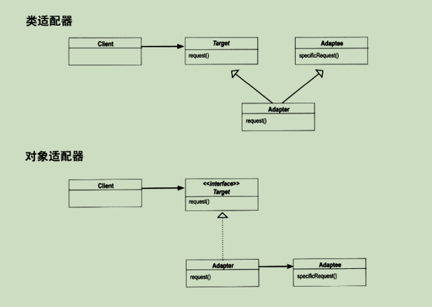

第一章
---

- 知道OO基础，并不足以让你设计出良好的OO系统。
- 良好的OO设计必须具备可复用、可扩充、可维护三个特性。
- 模式可以让我们建造出具有良好OO设计质量的系统。
- 模式被认为是历经验证的OO设计经验。
- 模式不是代码，而是针对设计问题的通用解决方案。你可把它们应用到特定的应用中。
- 模式不是被发明，而是被发现。
- 大多数的模式和原则，都是着眼于软件变化的主题。
- 大多数的模式都允许系统局部改变独立于其他部分。
- 我们常把系统中会变化的部分抽出来封装。
- 模式让开发人员之间有共享的语言，能够最大化沟通的价值。

OO基础：抽象；封装；多态；继承  
OO原则：封装变化；多用组合，少用继承；针对接口编程，不针对实现编程  
OO模式：  
策略模式——定义算法族，分别封装起来，让它们之间可以互相替换，此模式让算法的变化独立于使用算法的客户。  

利用继承来提供Duck的行为，这会导致下来哪些缺点？（ABDF）  
A、代码在多个自来中重复  
B、运行时的行为不容易改变  
C、我们不能让鸭子跳舞  
D、很难知道所有鸭子的全部行文  
E、鸭子不能同事又飞又叫  
F、改变会牵一发动全身，造成其他鸭子不想要的改变  

软件开发的一个不变真理：CHANGE   
不管当初软件设计得多好，一段时间之后，总是需要成长与改变，否则软件就会“死亡”。  

***设计原则***：  

1. 找出应用中可能需要变化之处，把它们独立出来，不要和那些不需要变化的代码混在一起。  
把会变化的部分取出并“封装”起来，好让其他不分不会受到影响。  
结果如何？代码变化引起的不经意后果变少，系统变得更有弹性。  
2. 针对接口编程，而不是针对实现编程。  
“针对接口编程”真正的意思是“针对超类型（supertype）编程”。
关键在于多态，利用多态，程序可以针对超类型编程，执行会根据实际状况执行到真正的行为，不会被绑死在超类型的行为上。

问：我是不是一定要先把系统做出来，再看看有哪些需要变化，然后才回头把这些地方分离&封装？  
答：不尽然。通常在你设计系统时，预先考虑到有哪些地方未来可能需要变化，于是提前在代码中加入这些弹性。你会发现、原则与模式可以应用在软件开发生命周期的任何阶段。  

问：用一个类代表一个行为，感觉似乎有点奇怪。类不是应该代表某种“东西”吗？类不是应该同时具备状态“与”行为吗？（参考Duck设计模式）  
答：在OO系统中，是的，类代表的东西一般都是既有状态（实例变量）又有方法。只是在本例中，碰巧“东西”是个行为。但是即使是行为，也仍然可以有状态和方法，例如，飞行的行为可以具有实例变量，记录飞行行为的属性（每秒翅膀拍动几下、最大高度和速度等）。

```java
public abstract class Duck {
	FlyBehavior flyBehavior;
	QuackBehavior quackBehavior;
	public Duck() {
	}
	
	public abstract void display();
	
	public void performFly() {
		flyBehavior.fly();
	}
	
	public void performQuack() {
		quackBehavior.quack();
	}
	
	public void swim() {
		System.out.println("All ducks float, even decoys!");
	}
}

public interface FlyBehavior {
	public void fly();
}

public class FlyWithWings implements FlyBehavior {
	public void fly() {
		System.out.println("I'm flying!");
	}
}

public class FlyNoWay implements FlyBehavior {
	public void fly() {
		System.out.println("I can't flying!");
	}
}

public interface QuackBehavior {
	public void quack();
}

public class Quack implements QuackBehavior {
	public void quack() {
		System.out.prinln("Quack");
	}
}

public class MuteQuack implements QuackBehavior {
	public void quack() {
		System.out.prinln("《Silece》");
	}
}

public class Squack implements QuackBehavior {
	public void quack() {
		System.out.prinln("Squack");
	}
}

public class MiniDuckSimulator {
	public static void main(String[] args) {
		Duck duck = new Duck();
		duck.performQuack();
		duck.performFly();
	}
}
```
***设计原则***  
多用组合，少用继承

**策略模式**  
定义了算法族，分别封装起来，让它们之间可以互相替换，此模式让算法的变化独立鱼使用算法的客户。  

问：如果设计模式这么棒，为何没有人简历相关的库呢？那样我们就不必自己动手了。  
答：设计模式比库的登基更高。设计模式告诉我们如何组织类和对象以解决某种问题。而且采纳这些设计并使它们适合我们特定的应用，是我们责无旁贷的事。  

问：库和框架不也是设计模式吗？  
答：库和框架提供了我们某些特定的实现，让我们的代码可以轻易地引用，但是这并不算是设计模式。有些时候，库和框架本身会用到设计模式，这样很好，因为一旦你了解了设计模式，会更容易了解这些API是围绕着设计模式构造的。  

问：那么，没有所谓设计模式的库？  
答：没错，但是稍后你回看到设计模式类目。你可以在应用中利用这些设计模式。  

知道抽象、继承、多态这些概念，并不会马上让你变成好的面向对象设计者。设计大师关心的是建立弹性的设计，可以维护，可以应付变化。  

- OO基础  
  - 抽象
  - 封装
  - 多态
  - 继承
- OO原则
  - 封装变化
  - 多用组合，少用继承
  - 针对接口编程，不针对实现编程
- OO模式
  - 策略模式—定义算法族，分别封装起来，让它们之间可以互相替换，此模式让算法的变化独立与使用算法的客户。

- 要点  
  - 知道OO基础，并不足以让你设计出良好的OO系统。
  - 良好的OO设计必须具备可以复用、可扩充、可维护三个特性。
  - 模式可以让我们建造出具有良好OO设计质量的系统。
  - 模式被认为是历史验证的OO设计经验。
  - 模式不是代码，而是针对设计问题的通用解决方案。你可把它们应用到特定的应用中。
  - 模式不是被发明的，而是被发现的。
  - 大多数的模式和原则，都着眼于软件变化的主题。
  - 大多数的模式都云栖系统局部改变独立鱼其他部分。
  - 我们常把系统中会变化的部分抽出来封装。
  - 模式让开发人员之间有共享的语言，能够最大化沟通的价值。

---
观察者（Observer）模式
---
认识观察者模式：  
我们看看报纸和杂事的订阅是怎么回事：  
1. 报社的业务就是初版报纸。
2. 向某家报社订阅报纸，只要他们有新报纸出版，就会给你送来。只要你是他们的订户，你就会一直收到新报纸。
3. 当你不想再看报纸的时候，取消订阅，他们就不会再送新报纸。
4. 只要报社还在运营，就会一直有人（或单位）向他们订阅报纸或取消订阅报纸。

**出版者+订阅者=观察者模式**  
出版者该称为“主题”（Subject），订阅者改称为“观察者”（Observer）。  

***观察者模式***：定义了对象之间的一对多依赖，这样一来，当一个对象改变状态时，它的所有依赖者都会收到通知并自动更新。

当两个对象之间松耦合，它们依然可以交互，但是不太轻清楚彼此的细节。  
观察者模式提供了一种对象设计，让主题和观察者之间松耦合。  

***设计原则***  

1. 为了交互对象之间的松耦合设计而努力。

松耦合的设计之所以能让我们建立有弹性的OO系统，能够应对变化，是因为对象之间的互相依赖讲到了最低。  

```java
//在WeatherData中实现主题接口
、、WeatherData实现了Subject接口
public class WeatherData implements Subject {
	private ArrayList observers;
	private float temperature;
	private float humidity;
	private float presure;
	
	public WeatherData() {
		//加上一个ArrayList来记录观察者，此ArrayList是在构造器中建立的。
		observers = new ArrayList();
	}
	
	//加到ArrayList中即可注册观察者
	public void registerObserver(Observer o) {
		observers.add(o);
	}
	
	//从ArrayList中删除即可取消注册
	public void removeObserver(Observer o) {
		int i = observers.indexOf(o);
		if (i >= 0) {
			observers.remove(i);
		}
	}
	
	//在这里，我们把状态告诉每一个观察者。
	//因为观察者都实现了update()，所以我们知道如何通知它们
	public void notifyObservers() {
		for (int i = 0; i < observers.size(); i++) {
			Observer observer = (Observer)observers.get(i);
			observer.update(temperature, humidity, presure);
		}
	}
	
	//当从气象站得到更新观测值时，我们通知观察者
	public void measurementsChanged() {
		notifyObservers();
	}
	
	public void setMeasurements(float temperature, float humidity, float presure) {
		this.temperature = temperature;
		this.humidity = humidity;
		this.presure = presure;
	}
	
	//WeatherData的其他方法
}
```
```java
//===布告板===
/**
* 此布告板实现了Object接口，所以可以从WeatherData对象中获得改变
* 实现了DisplayElement接口，因为我们的API规定所有的布告板都必须实现此接口
/
public class CurrentConditionDisplay implements Observer, DisplayElement {
	private float temperature;
	private float humidity;
	private Subject weatherData;
	
	//weatherData对象（也就是主题）做为注册之用
	public CurrentConditionDisplay(Subject weatherData) {
		this.weatherData = weatherData;
		weatherData.registerObserver(this);
	}
	
	//当update()被调用时，我们把温度和湿度保存起来，然后调用display()
	public void update(float temperature, folat humidity, folat pressure) {
		this.temperature = temperature;
		this.humidity = humidity;
		display();
	}
	
	//温度和湿度显示
	public void display() {
		System.out.println("Current conditions:" + temperature + " F degrees and " + humidity + "% humidity");
	}

}
```
```java
//利用内置java.util.Observerable重做气象站
import java.util.Observable;
import java.util.Observer;

public class WeatherData extends Observable {
	private float temperature;
	private float humidity;
	private float pressure;
	
	public WeatherData() {}
	
	public void setMeasurements(float temperature, float humidity, float pressure) {
		this.temperature = temperature;
		this.humidity = humidity;
		this.pressure = pressure;
		measurementsChanged();
	}
	
	public float getTemperature() {
		return temperature;
	}
	
	public float getHumidity() {
		return humidity;
	}
	
	public float getPressure() {
		return pressure;
	}
}
```
```java
import java.util.Observable;
import java.util.Observer;

public class CurrentConditionsDisplay implements Observer, DisplayElement {
	Observable observable;
	private float temperature;
	private float humidity;
	
	public CurrentConditionsDisplay(Observable observable) {
		this.observable = observable;
		observable.addObserver(this);
	}
	
	public void update(Observable obs, Object arg) {
		if (obs instanceof WeatherData) {
			WeatherData weatherData = (WeatherData)obs;
			this.temperature = weatherData.getTemperature();
			this.humidity = weatherData.getHumidity();
			display();
		}
	}
	
	public void display() {
		System.out.println)("Current conditions:" + temperature + "F degrees and " + humidity + "% humidity");
	}

}
```
```java
public class SwingObserverExample {
	JFrame frame;
	
	public static void main(String[] args) {
		SwingObserverExample example = new SwingObserverExample();
		example.go();
	}
	
	public void go() {
		frame = new JFrame();
		
		JButton button = new JButton("Should I do it?");
		button.addActionListener(new AngleListener());
        button.addActionListener(new DevilListener());
        frame.getContentPane().add(BorderLayout.CENTER, button);
        //这里设置frame属性
	}
	
	class AngleListener implements ActionListener {
		public void adtionPerformed(ActionEvent event) {
			System.out.println("Don't do it, you might regret it!");
		}
	}
	
	class DevilListener implements ActionListener {
		public void adtionPerformed(ActionEvent event) {
			System.out.println("Come on, do it!");
		}/
	}
}
```

- OO基础：抽象
- OO原则
	- 封装变化
	- 多用组合，少用继承
	- 针对接口编程，不针对实现编程
	- 为交互对象之间的松耦合设计而努力
- OO模式
	- 观察者模式—在对象之间定义一对多的依赖，这样一来，当一个对象改变状态，依赖它的对象都会收到通知，并自动更新。

要点：
- 观察者定义了对象之间一对多的关系
- 主题（也就是可观察者）用一个共同的接口来更新观察者
- 观察者和可观察者之间用松耦合方式结合（loosecoupling），可观察者不知道观察者的细节，只知道观察者实现了观察者接口。
- 使用此模式时，你可从被观察者出推（push）或拉（pull）数据（然而，推的凡事被认为更“正确”）
- 有多个观察者时，不可以依赖特定的通知次序
- Java有多种观察者模式的实现，包括了通用的java.util.Observable
- 要注意java.util.Observable实现上多带来的一些问题
- 如果有必要的话，可以实现自己的Observable，这并不难，不要害怕
- Swing大量使用观察者模式，许多GUI框架也是如此。
- 此模式也被应用在许多地方，例如：JavaBeans、RMI

***设计原则***
- 找出程序中会变化的方面，然后将其和固定不变的方面相分离
- 针对接口编程，不针对实现编程
- 多用组合，少用继承

---
装饰者模式
---

***设计原则***
开放-关闭原则：类应该对扩展开放，对修改关闭。

虽然似乎有点矛盾，但是的确有一些技术可以允许在不直接修改代码的情况下对其进行扩展。  
在选择需要被扩展的代码部分时要小心。每个地方都采用开放-关闭原则，是一种浪费，也没有必要。还会导致代码变得复杂且难以理解。

**装饰者模式**动态地将责任附加到对象上。若要扩展功能，装饰者提供了比继承更有弹性的替代方案。  

```java
//扩展FilterInputStream类，并覆盖read()方法
public class LowerCaseImputStream extends FilterInputStream {
	public LowerCaseInputStream(InputStream in) {
		super(in);
	}
	
	public int read() throws IOException {
		int c = super.read();
		return (c == -1 ? c : Character.toLowerCase((char)c));
	}
	
	public int read(byte[] b, int offset, int len) throws IOException {
		int result = super.read(b, offset, len);
		for (int i = offset; i < offset+result; i++) {
			b[i] = (byte)Character.toLowerCase((char)b[i]);
		}
		return result;
	}

}

//测试
//test.txt
// I know the Decorator Pattern therefore I RULE!
public class InputTest {
	public static void main(String[] args) throws IOException {
		int c;
		try {
			InputStream in = new LowerCaseInputStream(new BufferedInputStream(new FileInputStream("test.txt")));
			while((c = in.read()) >= 0) {
				Syste.out.println((char)c);
			}
			in.close();
		} catch (IOExcetion e) {
			e.printStackTrace();
		}
	}
}
//结果...
% java InputTest
i know the decorator pattern therefore i rule!
%
```

- OO基础
	- 抽象
	- 封装
	- 多型
	- 继承
- OO原则
	- 封装变化
	- 多用组合，少用继承
	- 针对接口编程，不针对实现编程
	- 为交互对象之间的松耦合设计而努力
	- 对扩展开放，对修改关闭
- OO模式
	- 策略模式
	- 观察者模式
	- 装饰者模式：动态地将责任附加到对象上。想要扩展功能，装饰者提供有别于继承的另一种选择。

要点：
- 继承属于扩展形式之一，但不见得是达到弹性设计得最佳方式
- 在我们的设计中，应该允许行为可以被扩展，而无需修改现有的代码
- 组合和委托可用于在运行时动态地加上新的行为
- 除了继承，装饰者模式也可以让我们扩展行为
- 装饰者模式意味着一群装饰者类，这些类用来包装具体组件
- 装饰者类反映出被装饰的组件类型（事实上，他们具有相同的类型，都经过接口或继承实现）
- 装饰者可以在被装饰者的行为前面与/或后面加上自己的行为，甚至被装饰者的行为整个去带掉，而达到特定的目的
- 你可以用无数个装饰者包装一个组件
- 装饰者一般对组件的客户是透明的，除非客户程序依赖于组件的具体类型
- 装饰者会导致设计中出现许多小对象，如果过度使用，会让程序变得很复杂

---
工厂模式
---

```java
public abstract class PizzaStore {

	public Pizza orderPizza(String type) {
		Pizza pizza;
		
		pizza = createPizza(type);
		
		pizza.prepare();
		pizza.bake();
		pizza.cut();
		pizza.box();
		
		return pizza;
	}
	
	protected abstract Pizza createPizza(String type);
	
	//其他方法
}
```
工厂方法用来处理对象的创建，并将这样的行为封装在子类中。这样，客户程序中关于超类的代码就和子类对象创建代码解耦了。  
```java
/*
工厂方法是抽象的，所以依赖子类来处理对象的创建
工厂方法必须返回一个产品。超类中定义的方法，通常使用到工厂方法的返回值。
工厂方法将客户（也就是超类中的代码）和实际创建具体产品的代码分割开来
*/
abstract Product factoryMethod(String type)
```
所有工厂模式都用来封装对象的创建。工厂方法模式（Factory Method Pattern）通过让子类决定该创建的对象是什么，来达到将对象创建的过程封装的目的。

***工厂方法模式***定义了一个创建对象的接口，但由子类决定要实例化的类是哪一个。工厂方法让类把实例化推迟到子类。  

问：当只有一个ConcreteCreator的时候，工厂方法模式有什么优点？  
答：尽管只有一个具体创建者，工厂方法模式依然很有用，因为它帮助我们将产品的“实现”从“使用”中解耦。如果增加产品或者改变产品的实现，Creator并不会受到影响（因为Creator与任何ConcreteProduct之前都不是紧耦合）。

问：工厂方法和创建者是否总是抽象的？  
答：不，可以定义一个默认的工厂方法来产生某些具体的产品，这么一来，即使创建者没有任何子类，依然可以创建产品。

问：每个商店基于传入的类型制造出不同种类的比萨。是否所有的具体创建者都必须如此？能不能只创建一种比萨？  
答：这里所采用的方式称为“参数化工厂方法”。它可以根据传入的参数创建不同的对象。然而，工厂进场只产生一种对象，不需要参数化。模式的这两种形式都是有效的。

问：利用字符串传入参数化的类型，似乎有点危险，然一吧Clam（蛤蜊）英文拼错，成了Calm（平静），要求供应“CalmPizza”，怎么办？  
答：说的很对，这样的情形会造成所谓的“运行时错误”。有几个其他更复杂的技巧可以避开这个麻烦，在便一时期就将参数上的错误挑出来。比方说，你可以创建代表参数类型的对象和使用静态常量或者Java 5所支持的enum。

问：对于简单工厂和工厂方法之间的差异，我依然感到困惑。他们看起来很类似，差别在于，在工厂方法中，返回比萨的类是子类。能解释一下吗？  
答：子类的确看起来很像简单工厂。简单工厂把全部的事情，在一个地方都处理完了，然而工厂方法却是创建一个框架，让子类决定要如何实现。比方说，在工厂方法中，orderPizza()方法提供了一般的框架，以便创建比萨，orderPizza()方法依赖工厂方法创建具体类，并制造出实际的比萨。可通过继承PizzaStore类，决定实际制造出的比萨是什么。简单工厂的做法，可以将对象的创建封装起来，单思简单工厂不具备工厂方法的弹性，因为简单工厂不能变更正在创建的产品。

**依赖倒置原则**  
***设计原则：要依赖抽象，不要依赖具体类***

几个指导方针，帮你避免在OO设计中违反依赖倒置原则：  
- 变量不可以持有具体类的引用。  
	如果使用new，就会持有具体类的引用。你可以改用工厂来避开这样的做法。
- 不要让类派生自具体类。
	如果派生自具体类，你就会依赖具体类。请派生自一个抽象（接口或抽象类）。
- 不要覆盖基类中已实现的方法。
	如果覆盖基类已实现的方法，那么你的基类就不是一个真正适合被继承的抽象。基类中已实现的方法，应该由所有的子类共享。

```java
public interface PizzaIngredientFactory {
	public Dough createDough();
	public Sauce CreateSauce();
	public Cheese createCheese();
	public Veggies[] createVeggies();
	public Pepperoni createPepperoni();
	public Clams createClam();
}

public class CheesePizza extends Pizza {
	PizzaIngredientFactory ingredientFactory;
	
	//要制作比萨，需要工厂提供原料。所以每个比萨类都需要从构造器参数中的大一个工厂，并把这个工厂存储在一个实例变量中。
	public CheesePizza(PizzaIngredientFactory ingredientFactory) {
		this.ingredientFactory = ingredientFactory;
	}
	
	void prepare() {
		System.out.println("Preparing " + name);
		dough = ingredientFactory.createFough();
		sauce = ingredientFactory.createSauce();
		cheese = ingredientFactory.createCheese();
	}
}
```
```java
//1.首先我们需要一个纽约比萨店
PizzaStore nyPizzaStore = new NYPizzaStore();
//2.现在已经有个比萨店了，可以接受订单
nyPizzaStore.orderPizza("cheese");
//3.orderPizza()方法首先调用createPizza()方法
Pizza pizza = createPizza("cheese");
//4.当createPizza()方法被调用时，也就开始涉及原料工厂
Pizza pizza = new CheesePizza(nyIngredientFactory);
//5.接下来需要准备比萨。一旦调用了prepare()方法，工厂将被要求准备原料
void prepare() {
	dough = factory.createDough();
	sauce = factory.createSauce();
	cheese = factory.createCheese();
}
//6.最后，我们得到了准备好的比萨，orderPizza()就会接着烘烤、切片、装盒

```

**抽象工厂模式**：提供一个接口，用于创建相关或依赖对象的家族，而不需要明确指定具体类。  
抽象工厂允许客户使用抽象的接口来创建一组相关的产品，而不需要知道（或关心）实际产出的具体产品是什么。这样一来，客户就从具体的产品中被解耦。  

[MerMaid文档](https://mermaid-js.github.io/mermaid/#/)  

要点：
- 所有的工厂都是用来封装对象的创建。
- 简单工厂，虽然不是真正的设计模式，但仍不失为一个简单的方法，可以将客户程序从具体类解耦。
- 工厂方法使用集成：把对象的创建委托给子类，子类实现工厂方法来创建对象。
- 抽象工厂使用对象组合：对象的创建被实现在工厂接口所暴露出来的方法中。
- 所有工厂模式都通过减少应用程序和具体类之间的依赖促进松耦合。
- 工厂方法允许类将实例化延迟到子类进行。
- 抽象工厂创建相关的对象家族，而不需要依赖它们的具体类。
- 依赖倒置原则，指导我们避免依赖具体类型，而要尽量依赖抽象。
- 工厂是很有威力的技巧，帮助我们针对抽象编程，而不要针对具体类编程。

---
单件模式
---

**单件模式（Singleton Pattern）：用来创建独一无二的，只能有一个实例的对象的入场券。**  
***单件模式***确保一个类只有一个实例，并提供一个全局访问点。  

```java
public class Singleton {
	private static Singleton uniqueInstance;
	
	private Singleton() {}
	
	public static synvhronized Singleton getInstance() {
		if (uniqueInstance == null) {
			uniqueInstance = new Singleton();
		}
		return uniqueInstance;
	}
	
}
```

1. 如果getInstance()的性能对应用程序不是很关键，就什么别做  
没错，如果你的应用程序可以接受getInstance()造成的额外负担，就忘了这件事吧。同步getInstance()的方法既简单又有效。但是你必须知道，同步一个方法可能造成程序执行效率下降100背。因此，如果将getInstance()的程序使用在频繁运行的地方，你可能就得重新考虑了。
2. 使用“急切”创建实例，而不用延迟实例化的做法  
```java
public class Singleton {
	private static Singleton uniqueInstance = new Singleton();
	
	private Singleton() {}
	
	public static Singleton getInstance() {
		return uniqueInstance;
	}
}
```
3. 用“双重检查加锁”，在getInstance()减少使用同步  
利用双重检查加锁（double-checked locking），首先检查是否实例已经创建了，如果尚未创建，“才”进行同步。这样一来，只有第一次会同步，这正是我们想要的。  
```java
/*
volatile关键词确保：当uniqueInstance变量被初始化成Singleton实例时，
多个线程正确地处理uniqueInstance变量
*/
public class Singleton {
	private volatile static Singleton uniqueInstance;
	
	private Singleton() {}
	
	public static Singleton getInstance() {
	/*
	检查实例，如果不存在，就进入同步区块。
	只有第一次才彻底执行这里的代码。
	*/
		if (uniqueInstance == null) {
			synchronized (Singleton.class) {
				//进入区块后，再检查一次。如果仍是null，才创建实例。
				if (uniqueInstance == null) {
					uniqueInstance = new Singleton();
				}
			}
		}
		return uniqueInstance;
	}
}
```
要点
- 单件模式确保程序中一个类最多只有一个实例。
- 单件模式也提供访问这个实例的全局点。
- 在Java中实现单件模式需要私有的构造器、一个静态方法和一个静态变量。
- 确定在性能和资源上的限制，然后小心地选择适当的方案来实现单件，以解决多线程的问题（我们必须认定所有的程序都是多线程的）。
- 如果不是采用第五版的Java 2，双重检查加锁实现会失效。
- 小心，你如果使用多个类加载器，可能导致单件失效而产生多个实例。
- 如果使用JVM 1.2或之前的banner，你必须建立单件注册表，以免垃圾收集器将单件回收。

---
封装调用：命令模式
---

***命令模式***将“请求”封装成对象，以便使用不同的请求、队列或者日志来参数化其他对象。命令模式也支持可撤销的操作。  

```java
public class RemoteControlWithUndo {
	Command[] onConnands;
    Command[] offConnands;
    //前一个命令将被记录在这里
    Command undoCommand;
    
    public RemoteControlWithUndo() {
    	onCommands = new Command[7];
    	offCommands = new Command[7];
    	
    	Command noCommand = new NoCommand;
    	for (int i = 0; i < 7; i++) {
    		onCommands[i] = noCommand;
            offCommands[i] = noCommand;
    	}
    	//一开始，并没有所谓的“前一个命令”，所以将它设置成NoCommand的对象
    	undoCommand = noCommand;
    }
    
    public void setCommand(int slot, Command onCommand, Command offCommand) {
    	onCommands[slot] = onCommand;
    	offCommands[slot] = offCommand;
    }
    
    public void onButtonWasPushed(int slot) {
    	onCommands[slot].execute();
    	/*
    	当按下按钮，我们取得这个命令，并优先执行它，
    	然后将它记录在undoCommand实例变量中。不管
    	是“开”或“关”命令，我们的处理方法都是一样的。
    	*/
    	undoCommand = onCommands[slot];
    }
    
    public void offButtonWasPushed(int slot) {
    	offCommands[slot].execute();
        /*
    	当按下按钮，我们取得这个命令，并优先执行它，
    	然后将它记录在undoCommand实例变量中。不管
    	是“开”或“关”命令，我们的处理方法都是一样的。
    	*/
    	undoCommand = offCommands[slot];
    }
    
    public void undoButtonWasPushed() {
    	/*
    	当按下撤销按钮，我们调用undoCommand实例变
    	量的undo()方法，就可以倒转前一个命令。
    	*/
    	undoCommand.undo();
    }
    
    public String toString() {
    	//toString...
    }
}
```

命令模式的更多用途：  
- 队列请求
- 日志请求

要点：
- 命令模式将发出请求的对象和执行请求的对象解耦。
- 在被解耦的两者之间是通过命令对象进行沟通的。命令对象封装了接收者和一个或一组动作。
- 调用者通过调用命令对象的execute()发出请求，这会使得接收者的动作被调用。
- 调用者可以接受命令当作参数，甚至在运行时动态地进行。
- 命令可以支持撤销，做法是实现一个undo()方法来回到execute()被执行前的状态。
- 宏命令是命令的一种简单的延伸，允许调用多个命令。宏方法也可以支持撤销。
- 实际操作时，很常见使用“聪明”命令对象，也就是直接实现了请求，而不是将工作委托给接受者。
- 命令也可以用来实现日志和事务系统。

---
适配器模式与外观模式
---

```java
//包装了鸭子适配器的火鸡...
public interface Duck {
	public void quack();
	public void fly();
}

public class MallardDuck implements Duck {
	public void quack() {
		System.out.pritln("Quack");
	}
	
	public void fly() {
		System.out.println("i'M flying");
	}
}

public interface Turkey {
	public void gobble();
	public void fly();
}

public class WildTurkey implements Turkey {
	public void gobble() {
		System.out.println("Gobble gobble");
	}
	
	public void fly() {
		System.out.println("I'm flying a short distance");
	}
}

publc class TurkeyAdapter implements Duck {
	Turkey turKey;
	
	public TurkeyAdapter(Turkey turkey) {
		this.turkey = turkey;
	}
	
	public void quack() {
		turkey.gobble();
	}
	
	public void fly() {
		for (int i = 0; i < 5; i++) {
			turkey.fly();
		}
	}
}

public class DuckTestDrive {
	public static void main(String[] args) {
		MallardDuck duck = new MallardDuck();
		
		WildTurkey turkey = new WildTurkey();
		Duck turkeyAdapter = new TurkeyAdapter(turkey);
		
		System.out.println("The Turkey says...");
		turkey.gobble();
		turkey.fly();
		
		System.out.println("\nThe Turkey says...");
		testDuck(duck);
		
        System.out.println("\nThe TurkeyAdapter says...");
		testDuck(turkeyAdapter;
	}
	
	static void testDuck(Duck duck) {
		duck.quack();
		duck.fly();
	}
}
```

客户使用适配器的过程如下：  
1. 客户通过目标接口调用适配器的方法对适配器发出请求。
2. 适配器使用被适配者接口把请求转换成被适配者的一个或多个调用接口。
3. 客户接受到调用的结果，但并未察觉这一切是适配器在起转换作用。

***适配器模式***将一个类的接口，转换成客户期望的另一个接口。适配器让原本接口不兼容的类可以合作无间。  

对象适配器和类适配器使用两种不同的适配方式：分别是组合与继承



对象适配器：  
- 使用组合。可以适配某个类，也可以适配该类的任何子类

类适配器：  
- 使用继承。只能够采用某个特定的被适配类。但是有个很大的优点：不需要重新实现整个被适配者。必要的时候，可以覆盖被适配者的行为

真实世界的适配器：
- 旧世界的枚举器：  
	早期的集合（collection）类型（例如：Vector、Stack、Hashtable）都实现了一个名为elements()的方法。该方法会返回一个Enumeration（举）。这个Enumeration接口可以逐一走过此集合内的每个元素，而无需知道他们在集合内是如何被管理的。
- 新世界的迭代器：  
	当Sun推出更新后的集合类时，开始使用了Iterator（迭代器）接口，这个接口和枚举接口很像，都可以让你遍历此级和类型内的每个元素，但不同的是，迭代器还提供了删除元素的能力。

外观不只是简化了接口，也将客户从组件的子系统中解耦。  
外观和适配器可以包装许多类，但是外观的意图是简化接口，而适配器的意图是将接口转换成不同接口。  

***外观模式***提供了一个统一的接口，用来访问子系统中的一群接口。外观定义了一个高层接口，让子系统更容易使用。  

设计原则：***“最少知识”原则***：只和你的密友谈话。  
当你在设计一个系统，不管是任何对象，你都要注意它所交互的类有哪些，并注意它和这些类是如何交互的。  
这个原则希望我们在设计中，不要让太多的类耦合在一起，免得修改系统中的一部分，会影响到其他部分。如果许多类之间相互依赖，那么这个系统就会变成一个易碎的系统，它需要花许多成本维护，也会因为太复杂而不容易被其他人了解。  

要点：  
- 当需要使用一个现有的类而其接口并不符合你的需要时，就使用适配器。
- 当需要简化并统一一个很大的接口或者一群复杂的接口时，使用外观。
- 适配器改变接口以符合客户的期望。
- 外观嫁给你客户从一个复杂的子系统中解耦。
- 实现一个适配器可能需要一番功夫，也可能不费功夫，视目标接口的大小与复杂度而定。
- 实现一个外观，需要将子系统组合进外观中，然后将工作委托给子系统执行。
- 适配器模式有两种形式：对象适配器和类适配器。类适配器需要用到多重继承。
- 你可以为一个子系统实现一个以上的外观。
- 适配器将一个对象包装起来以改变其接口；装饰者将一个对象包装起来以增加新的行为和责任；而外观将一群对象“包装”起来以简化其接口。

---
模板方法模式：封装算法
---

***模板方法模式***在一个方法中定义一个算法的骨架，而将一些步骤延迟到子类中。模板方法使得子类可以在不改变算法结构的情况下，重新定义算法中的某些步骤。

```java
public class CoffeeWithHook extends CaffeineBeverageWithHook {
	
	public void brew() {
		System.out.printlm("Dripping Coffee through filter");
	}
	
    public void addCondiments() {
		System.out.println("Adding Sugar and Milk");
	}
	
	public boolean customerWantsCondiments() {
		String answer = getUserInput();
		
		if (answer.toLowerCase().startsWith("y")) {
			return true;
		} else {
			return false;
		}
	}

	private String getUserInput() {
		String answer = null;
		
        System.out.print("Would you like milk and Sugar with your coffee (y/n)?");
        
        BufferedReader in = new BufferedReader(new InputStreamReader(System.in));
        try {
        	answer = in.readLine();
        } catch (IOException ioe) {
        	System.out.println("IO error trying to read your answer");
        }
        if (answer == null) {
        	return "no";
        }
        return answer;
	}
}
```

设计原则：***好莱坞原则***别调用我们，我们会调用你。  
好莱坞原则可以给我们一种防止“依赖腐败”的方法。当高层组件依赖底层组件，而底层组件又依赖高层组件，而高层组件又依赖边侧组件，而边侧组件又依赖底层组件时，依赖腐败就发生了。在这种情况下，没有人可以轻易地搞懂系统是如何设计的。  
在好莱坞原则之下，我们允许底层组件将自己挂钩到系统上，但是高层组件会决定什么时候和怎样使用这些底层组件。换句话说，高层组件对待底层组件的方式是“别调用我们，我们会调用你”。  

```java
public class Duck implements Comparable {
	String name;
	int weight;
	
	public Duck(String name, int weight) {
		this.name = name;
		this.weight = weight;
	}
	
	public String toString() {
		return name + " weight " + weight;
	}
	
	public int comparaTo(Object object) {
		Duck otherDuck = (Duck)object;
		
		if (this.weight < otherDuck.weight) {
			return -1;
		} else if (this.weight = otherDuck.weight) {
			return 0;
		} else {
			return 1;
		}
	}
}

public class DuckSortTestDrive {
	public static void main(String[] args) {
		Duck[] ducks = {
			new Duck("Daffy",8),
            new Duck("Dewey",2),
            new Duck("Howard",7),
            new Duck("Louie",2),
            new Duck("Donald",10),
            new Duck("Huey",2)
		};
		
		System.out.println("Before sorting:");
		display(ducks);
		
		Arrays.sort(ducks);
		
		System.out.println("\nAfter sorting:");
		display(ducks);
	}
	
	public static void display(Duck[] ducks) {
		for (int i = 0; i < ducks.length; i++) {
			System.out.println(ducks[i]);
		}
	}
}
```

要点：  
- “模板方法”定义了算法的不住，把这些步骤的实现延迟到子类。
- 模板方法模式为我们提供了一种代码复用的重要技巧。
- 模板方法的抽象类可以定义具体方法、抽象方法和钩子。
- 抽象方法由子类实现。
- 钩子是一中方法，它在抽象类中不做事，或者只做默认的事情，子类可以选择不要去覆盖它。
- 为了防止子类改变模板方法中的算法，可以将模板方法声明为final。
- 好莱坞原则告诉我们，将策略权放在高层模板中，以便决定如何以及何时调用底层模块。
- 你将在真实世界代码中看到模板方法模式的许多变体，不要期待他们全都是一眼就可以被你认出来的。
- 策略模式和模板方法模式都封装算法，一个用组合，一个用继承。
- 工厂方法是模板方法的一种特殊版本。

---
迭代器与组合模式：管理良好的集合
---

在餐厅菜单中加入一个迭代器  
想要在餐厅中加入一个迭代器，我们需要先定义迭代器接口：  
```java
public interface Iterator {
	//会返回一个布尔值，让我们知道是否还有更多的元素
	boolean hasNext();
	//返回下一个元素
	Object next();
}
```
现在我们需要实现一个具体的迭代器，为擦你太能干菜单服务：  
```java
public class DinerMenuIterator implements Iterator {
	MenuItem[] items;
	int position = 0;
	
	public DinerMenuIterator(MenuItem[] items) {
		this.items = items;
	}
	
	public Object next() {
		MenuItem menuItem = items[position];
		position = position + 1;
		return menuItem;
	}
	
	public boolean hasNext() {
		if (position >= items.length || items[position] == null) {
			return false;
		} else {
			return true;
		}
	}

}
```
用迭代器改写餐厅菜单  
```java
public class DinerMenu {
	static final int MAX_ITEMS = 6;
	int numberOfItems = 0;
	MenuItem[] menuItems;
	
	//构造器在这里
	
	//addItem在这里
	
	public Iterator createIterator() {
		return new DinerMenuIterator(menuItems);
	}
	
	//菜单的其他方法在这里
}
```
修正女招待的代码  
```java
public class Waitress {
	PancakeHouseMenu pancakeHouseMenu;
	DinerMenu dinerMenu;
	
	public Waitress(PancakeHouseMenu pancakeHouseMenu, DinerMenu dinerMenu) {
		this.pancakeHouseMenu = pancakeHouseMenu;
		this.dinerMenu = dinerMenu;
	}
	
	public void printMenu() {
		Iterator pancakeIterator = pancakeHouseMenu.createIterator();
		Iterator dinerIterator = dinerMenu.createIterator();
		System.out.println("MMENU\n----\nBREAKFAST");
		printMenu(pancakeIterator);
        System.out.println("\nLUNCH");
        printMenu(dinerIterator);
	}
	
	private void printMenu(Iterator iterator) {
		while (iterator.hasNext()) {
			MenuItem menuItem = (MenuItem)iterator.nex();
			System.out.print(menuItem.getName() + ", ");
            System.out.print(menuItem.getPrice() + " -- ");
            System.out.print(menuItem.getDescription());
		}
	}
	
	//其他的方法

}
```
```java
//测试代码
public class MenuTestDrive {
	public static void main(String args[]) {
		PancakeHouseMenu pancakeHouseMenu = new PancakeHouseMenu();
		DinerMenu dinerMenu = new DingerMenu();
		
		Waitress waitress = new Waitress(pancakeHouseMenu, dinerMenu);
		
		waitress.printMenu();
	}
}
```
***迭代器模式***提供一种方法顺序访问一个聚合对象中的各个元素，而又不暴露其内部的表示。  
迭代器模式让我们能游走于聚合内的每一个元素，而又不是暴漏其内部的表示。  
把游走的任务放在迭代器上，而不是聚合上。这样简化了聚合的接口和实现，也让责任各得其所。  

**单一责任**  
如果我们允许我们的聚合实现它们内部的集合，以及相关的操作和遍历的方法，又会如何？我们已经知道这回增加聚合中的方法个数，但又怎样呢？为社会么这个么做不好？  
想知道为什么，首先你需要认清楚，当我们允许一个类不但要完成自己的事情（管理某种聚合），还同时要担负更多的责任（例如遍历）时，我们就给了这个类两个变化的原因。如果这个集合改变的话，这个类也必须改变；如果我们遍历的方式改变的话，这个类也必须耕者改变。所以，再一次地，我们的老朋友“改变”又成了设计原则的中心：  

***设计原则：一个类应该只有一个引起变化的原因***  

类的每个责任都有改变的潜在区域。超过一个责任，意味着超过一个便便的区域。  
这个原则告诉我们，尽量让每个类保持单一责任。  

内聚（cohesion）这个术语你应该听过，它用来度量一个类或模块紧密地达到单一目的或责任。  
但一个模块或一个类被设计成只支持一组相关的功能时，我们说它具有高内聚；反之，当被设计成支持一组不相关的功能时，我们说它具有低内聚。  
内聚是一个比单一责任原则更普遍的概念，但两者其实关系是很紧密的。遵守这个原则的类具有很高的凝聚力，而且比背负许多责任的低内聚类更容易维护。  

```java
//重做咖啡厅代码
public class CafeMenu implements Menu {
	Hashtable menuItems = new Hashtable();
	
	public cafeMenu() {
		//构造器的代码写在这里
	}
	
	public void addItem(String name, String description, boolean vegetarian, double price) {
		MenuItem menuItem = new MenuItem(name, descriptionm vegetarian, price);
		menuItems.put(menuItem.getName(), menuItem);
	}
	
	public Iterator createIterator() {
		return menuItems.values().iterator();
	}
}

//让女招待认识咖啡厅菜单
public class Waitress {
	Menu pancakeHouseMenu;
	Menu dinerMenu;
	Menu cafeMenu;
	
	public Waitress(Menu pancakeHouseMenu, Menu dinerMenu, Menu cafeMenu) {
		this.pancakeHouseMenu = pancakeHouseMenu;
		this.dinerMenu = dinerMenu;
		this.cafeMenu = cafeMenu;
	}
	
	public void printMenu() {
		Iterator pancakeIterator = pancakeHouseMenu.createIterator();
		Iterator dinerIterator = dinerMenu.createIterator();
		Iterator cafeIterator = cafeMenu.createIterator();
		System.out.println("MMENU\n----\nBREAKFAST");
		printMenu(pancakeIterator);
        System.out.println("\nLUNCH");
        printMenu(dinerIterator);
        System.out.println("\nDINNER");
        printMenu(cafeIterator);
	}
	
	private void printMenu(Iterator iterator) {
		while (iterator.hashNext()) {
			MenuItem menuItem = (MenuItem)iterator.nex();
			System.out.print(menuItem.getName() + ", ");
            System.out.print(menuItem.getPrice() + " -- ");
            System.out.print(menuItem.getDescription());
		}
	}
}
```

***组合模式***允许你将对象组合成树形结构来表现“整体/部分”层次结构。组合能让客户以一直的方式处理个别对象以及对象组合。  

组合模式让我们能用树形方式创建对象的结构，树里卖你包含里组合以及个别的对象。  
使用组合结构，我们能把相同的操作应用在组合和个别对象上。换句话说，在大多数情况下，我们可以忽略对象组合和个别对象之间的差别。  

要点：  
- 迭代器允许访问聚合的元素，而不需要暴漏它的内部结构。
- 迭代器将遍历聚合的而工作封装进一个对象中。
- 当使用迭代器的时候，我们依赖聚合提供遍历。
- 迭代器提供了一个通用接口，让我们遍历聚合的项，当我们编码使用聚合的项时，就可以使用多态机制。
- 我们应该努力让一个类只分配一个责任。
- 组合模式提供一个结构，可同时包容个别对象和组合对象。
- 组合模式允许客户对个别对象以及组合对象一视同仁。
- 组合结构内的任意对象称为组件，组件可以时组合也可以是叶节点。
- 在实现组合模式时，有许多设计上的折衷。你要根据需要平衡透明性和安全性。

- 策略模式：封装可呼唤的行为，并使用委托决定使用哪一个  
- 适配器模式：改变一个或多个类的接口  
- 迭代器模式：提供一个方式来遍历集合，而无需暴露集合的实现
- 外观模式：简化一群类的接口
- 组合模式：客户可以将对象的集合以及个别的对象一视同仁
- 观察者模式：当某个状态改变时，允许一群对象能被通知到

---
状态模式：事务的状态
---

```java
//糖果机
public class GumballMachine {
	final static int SOLD_OUT = 0;
	final static int NO_QUARTER = 1;
	final static int HAS_QUARTER = 2;
	final static int SOLD = 3;
	
	int state = SOLD_OUT;
	int count = 0;
	
	public GumballMachine(int count) {
		this.count = count;
		if (count > 0) {
			state = NO_QUARTER;
		}
	}
	
	public void insertQuarter() {
		if (state == HAS_QUARTER) {
			System.out.pritln("You can't insert another quarter");
		} else if (state == NO_QUARTER) {
			state = HAS_QUARTER;
			System.out.pritln("You inserted a quarter");
		} else if (state == SOLD_OUT) {
			System.out.pritln("You can't insert a quarter, the machine is sold out");
		} else if (state == SOLD) {
			System.out.pritln("Please wait, we're already giving you gumball");
		}
	}
	
    public void ejectQuarter() {
		if (state == HAS_QUARTER) {
			System.out.pritln("Quarter returned");
			state = NO_QUARTER;
		} else if (state == NO_QUARTER) {
			state = HAS_QUARTER;
			System.out.pritln("You haven't inserted a quarter");
		} else if (state == SOLD_OUT) {
			System.out.pritln("Sorry, you already turned the crank");
		} else if (state == SOLD) {
			System.out.pritln("You can't eject, you haven't inserted a quarter yet");
		}
	}
	
	public void turnCrank() {
		if (state == SOLD) {
			System.out.pritln("Truning twice doesn't get you another gumball!");
		} else if (state == NO_QUARTER) {
			System.out.pritln("You turned but where's no quarter");
		} else if (state == SOLD_OUT) {
			System.out.pritln("You turned, but there are no gumballs");
		} else if (state == HAS_QUARTER) {
			System.out.pritln("You turned...");
			state = SOLD;
			dispense();
		}
	}
	
	public void dispense() {
		if (state == SOLD) {
			System.out.pritln("A gumball comes rolling out the slot");
			count = count - 1;
			if (count == 0) {
				System.out.println(Oops, out of gumballs!);
				state = SOLD_OUT;
			} else {
				state = NO_QUARTER;
			}
		} else if (state == NO_QUARTER) {
			System.out.pritln("You need to pay first");
		} else if (state == SOLD_OUT) {
			System.out.pritln("No gumball dispensed");
		} else if (state == HAS_QUARTER) {
			System.out.pritln("No gumball dispensed");
		}
	}
	
	//这里是像toString()和refill()的其他的方法
	
}
```

***状态模式***允许对象在内部状态改变时改变它的行为，对下个看起来好像修改了他的类。

要点：
- 状态模式允许一个对象基于内部状态而拥有不同的行为。
- 和程序状态机（PSM）不同，状态模式用类代表状态。
- Context会将行为委托给当前状态对象。
- 通过将每个状态封装进一个类，我们把以后需要做的任何改变局部化了。
- 状态模式和策略模式有相同的类图，但是它们的意图不同。
- 策略模式通常会用行为或算法来配置Context类。
- 状态模式允许Context随着状态的改变而改变行为。
- 状态转换可以由State类或Context类控制。
- 使用状态模式通常会导致设计中类的数目大量增加。
- 状态类可以被多个Context实例共享。


代理模式：控制对象访问
---

你的客户对象所做的就像是在做远程方法调用，但其实只是调用本地堆中的“代理”对象上的方法，再由代理处理所有网络通信的底层细节。  

Java RMI  
RMI提供了客户辅助对象和服务辅助对象，为客户辅助对象创建和服务对象相同的方法。RMI的好处在于你不必亲自写任何网络或I/O代码。客户程序调用远程方法（即真正的服务所在）就和在运行在客户自己的本地JVM上对对象进行正常方法调用一样。  
RMI也提供了所有运行时的基础设施，好让这一切正常工作。这包括了查找服务（lookup service），这个服务用来寻找和访问远程对象。  
关于RMI调用和本地（正常的）的方法调用，有一个不同点。虽然调用远程方法就如同调用本地方法一样，但是客户辅助对象会通过网络发送方法调用，所以网络和I/O的确时存在的。关于网络和I/O部分，我们知道写什么？  
我们知道网络和I/O是有风险的，容易失败，所以随时都可能抛出异常，也因此，客户必须意识到风险的存在。  
RMI称呼（译注：terminology，术语，重点在概念本身；nomenclature，称呼，重点在概念上贴的标签）：RMI将客户辅助对象成为stub（桩），服务辅助对象成为skeleton（骨架）。  

制作远程服务  
1. 制作远程接口
	1. 扩展java.rmi.Remote。
	```java
	public interface MyRemote extends Remote{}
	```
	2. 声明所有的方法都会抛出RemoteException。
	```java
	import java.rmi.*
	public interface MyRemote extends Remote{
		public String sayHello() throws RemoteException;
	}
	```
	3. 确定变量和返回值是属于原语（primitive）类型或者可序列化（Serializable）类型。
2. 制作远程的实现
	1. 实现远程接口。
	```java 
	public class MyRemoteTmpl extends UnicastRemoteObject implements MyRemote {
		public String sayHello() {
			return "Server says,'Hey'";
		}
		//...
	}
	```
	2. 扩展UnicastRemoteObject。
	```java 
		public class MyRemoteTmpl extends UnicastRemoteObject implements MyRemote {
	```
	3. 设计一个不带变量的构造器，并声明RemoteException.
	```java
	public MyRemoteImpl() throws RemoteException {}
	```
	4. 用RMI Registry注册此服务。
	```java
	try {
		MyRemote service = new MyRemoteImpl();
		Naming.rebind("RemoteHello", service);
	} catch(Exception ex) {
		...
	}
	```
3. 利用rmic产生的stub和skeleton
	在远程实现类（不是远程接口）上执行rmic
4. 启动RMI registry（rmiregistry）
	开启一个终端，启动rmiregistry
5. 开始远程服务
	开启一个终端，启动服务

服务端的完整代码  
```java
//远程接口
import java.rmi.*;
public interface MyRemote extends Remote {
	public String sayHello() throws RemoteException;
}

//远程服务（实现）
import java.rmi.*;
import java.rmi.server.*;
public class MyRemoteImpl extends UnicastRemoteObject implements MyRemote {
	public String sayHello() {
		return "Server says, 'Hey'"
	}
	
	public MyRemoteImol() throws RemoteException{}
	
	public static void main(Stirng[] args) {
		try {
			MyRemote service = new MyRemoteImpl();
			Naming.rebind("RempteHello", service);
		} catch(Exception ex) {
			ex.printStackTrace();
		}
	}
}
```
```java
//完整的客户代码
import java.rmi.*;
public class MyRemoteClient {
	public static void main(String[] args) {
		new MyRemoteClient().go();
	}
	
	public void go() {
		try {
			MyRemote service = (MyRemote)Naming.lookup(rmi://127.0.0.1/RemoteHello);
			String s = service.sayHello();
			System.out.ptintln(s);
		} catch(Exception e) {
			e.printStackTrace();
		}
	}
}
```

***代理模式为另一个对象提供一个替身或占位符以控制对这个对象的访问***  
使用代理模式创建代表（representative）对象，让代表对象控制某对象的范文，被代理的对象可以是远程的对象、创建开销大的对象那个或需要安全控制的对象。  

远程代理：  
	远程代理可以作为另一个JVM上对象的本地代表。调用代理的方法，会被代理利用网络转发到远程执行，并且结果会通过网络返回给代理，再由代理将结果转给客户。  

虚拟代理：  
	虚拟代理作为创建开销大的对象的代表。虚拟代理经常知道我们真正需要用给对象的时候才创建它。当对象在创建前和创建中时，由虚拟机代理来扮演对象的替身。对象创建后，代理就会将请求直接委托给对象。  
	
显示CD封面  
  展示最喜欢的CD封面。建立一个CD标题菜单，然后从Amazon.com等网站的在线服务中取得CD封面的图。限于链接贷款和网络负载，下载可能需要一些时间，所以在等待图像加载的时候，应该显示一些东西。我们也不希望在等待图像时整个应用程序被挂起。一旦图像被加载完成，刚才显示的东西应该消失，图像显示出来。  

ImageProxy如何工作：  
1. ImageProxy首先创建要给ImageIcon，然后开始从网络URL上加载图像。
2. 在加载的过程中，ImageProxy显示“CD封面加载中，请稍后...”。
3. 当图像加载完毕，ImageProxy把所有方法调用委托给真正的ImageIcon，这些方法包括了paintIcon()，getWidth()和getHeight()。
4. 如果用户请求新的图像，我们就创建新的代理，重复这样的过程。

```java
class ImageProxy implements Icon {
	ImageIcon imageIcon;
	URL imageURL;
	Thread retrievalThread;
	boolean retrieving = false;
	
	public ImageProxy(URL url) {
		imageURL = url;
	}
	
	public int getIconWidth() {
		if (imageIcon != null) {
			return imageIcon.getIconWidth();
		} else {
			return 800;
		}
	}
	
	public int getIconHeight() {
		if (imageIcon != null;) {
			return imageIcon.getIconHeight();
		} else {
			return 600;
		}
	}
	
	public void paintIcon(final Commponent c, Graphics g, int x, int y) {
		if (imageIcon != null) {
			imageIcon.paintIcon(c, g, x, y);
		} else {
			g.drawString("Loading CD cover, please wait...", x+300, y+190)
			if (!retrieving) {
				retrieving = true;
				retrievalThread = new Thread(new Runable(){
					public void run() {
						try {
							imageIcon = new ImageIcon(imageURL, "CD Cover");
							c.repaint();
						} catch(Exception e) {
							e.printStackTrace();
						}
					}
				});
				retrievalThread.start();
			}
		}
	}
}
```
```java
import java.lang.reflect.*;
public class OwnerInvocationHandler implements InvocationHandler {
	PersonBean person;
	
	public OwnerInvocationHandler(PersonBean person) {
		this.person = person;
	}
	
	public Object invoke(Object proxy, Method method, Object[] args) throws IllegalAccessException {
		try {
			if (method.getName().startsWith("get")) {
				return method.invoke(person, args);
			} else if(method.getName().equals("setHotOrNotRating")) {
				throws new IllegalAccessException();
			} else if(method.getName().startsWith("set")) {
				return method.invoke(person, args);
			}
		} catch (InvocationTragetException e) {
			e.printStachTrace();
		}
		return null;
	}
}
```
```java
PersonBean getOwnerProxy(PersonBean person) {
	return (PersonBean) Proxy,newProxyInstance(
		person.getClass().getClassLoader(), 
		person.getClass().getInterfaces(), 
		new OwnerInvocationHandler(person));
}
```
```java
public class MatchMakingTestDrive {
	public static void main(String[] args) {
		MatchMakingTestDrive test = new MatchMakingTestDrive();
		test.drive();
	}
	
	public MatchMakingTestDrive() {
		initializeDatabase();
	}
	
	public void drive() {
		PersonBean joe = getPersonFromDatabase("Joe Javabean");
		PersonBean ownerProxy = getOwnerProxy(joe);
		System.out.println("Name is " + ownerProxy.getName());
		ownerProxy.setINterests("bowling, Go");
		System.out.println("Interests set from owner pRoxy");
		try {
			ownerProxy.setHotOrNotRating(10);
		} catch(Exception e) {
			System.out.println("Can't set rating from owner proxy");
		}
		System.out.println("Rating is " + ownerProxy.getHotOrNotRating);
		
		PersonBean nonOwnerProxy = getNonOwnerProxy(joe);
		System.out.println("Name is " + nonOwnerProxy.getName());
		try {
			nonOwnerProxy.setInterests("bowling, Go");
		} catch(Exception e) {
			System.out.println("Can't set interests form non owner proxy");
		}
		nonOwnerProxy.setHotOrNotRating(3);
		System.out.println("Rating set from non Owner proxy");
		System.out.println("Rating is " + nonOwnerProxy.getHotOrNotRating());
	}
	//...
}
```

- 防火墙代理（Firwall Proxy）控制网络资源的额访问，保护主题免于“坏客户”的侵害。  
- 智能引用代理（Smart Reference Proxy）当主题被引用时，进行额外的动作，例如计算一个对象被引用的次数。  
- 缓存代理（Caching Proxy）为开销大的运算结果提供暂时存储：它也允许多个客户共享结果，以减少计算或网络延迟。  
- 同步代理（Synchronization Proxy）在多线程的情况下为主题提供安全的访问。  
- 复杂隐藏代理（Complexity Hiding Proxy）用来隐藏一个类的复杂集合的复杂度，并进行访问控制。有时候也称为外观代理（Facade Proxy），这不难理解。复杂隐藏代理和外观模式是不一样的，因为代理控制的访问，而外观模式只提供另一组接口。  
- 写入时复制代理（Copy-On-Write Proxy）用来控制对象的复制，方法是延迟对象的复制，知道客户真的需要位置。这是虚拟代理的变体。  

要点：  
- 代理模式为另一个对象提供一个替身或占位符以访问这个对象。
- 代理模式为另一个对象提供代表，以便控制客户对对象的访问，管理访问的方式有许多种。
- 远程代理管理客户和远程对象之间的交互。
- 虚拟代理控制访问实例化开销大的对象。
- 保护代理基于调用者控制对对象方法的访问。
- 代理模式有许多变体，例如：缓存代理、同步代理、防火墙代理和写入时复制代理。
- 代理在结构上类似装饰着，但是目的不同。
- 装饰着模式为对象加上行为，而代理则是控制访问。
- Java内置的代理支持，可以根据需要建立动态代理，并将所有调用分配到所选的处理器。
- 就和其他的包装者（wrapper）一样，代理会造成你的设计中类的数目增加。

复合模式：模式的模式
---


