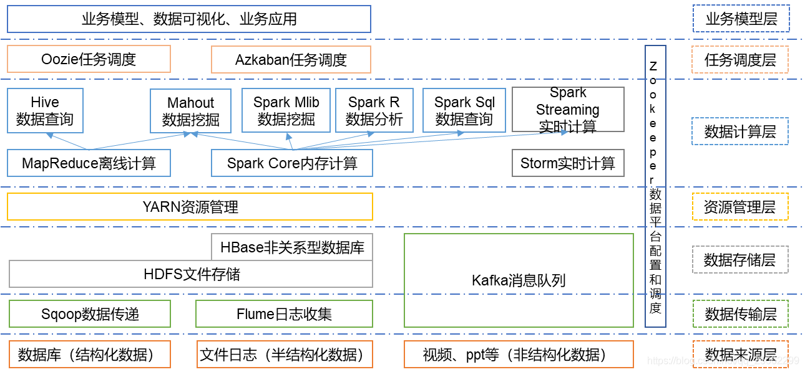

[大数据Hadoop生态圈](https://blog.csdn.net/qq_25062299/article/details/95592877)

Hadoop是目前应用最广泛的分布式处理框架，其具备可靠、高效、可伸缩等特点。  

Hadoop的核心组件是HDFS、MapReduce。随着处理任务不同，各种组件相继出现，丰富Hadoop生态圈，目前生态圈结构大致如图所示：

根据服务对象和层次分为：数据来源层、数据传输层、数据存储层、资源管理层、数据计算层、任务调度层、业务模型层。接下来对Hadoop生态圈中出现的相关组件做一个简要介绍。

## HDFS（分布式文件系统）

HDFS是整个hadoop体系的基础，负责数据的存储与管理。HDFS有着高容错性（fault-tolerant）的特点，并且设计用来部署在低廉的（low-cost）硬件上。而且它提供高吞吐量（high throughput）来访问应用程序的数据，适合那些有着超大数据集（large data set）的应用程序。

client：切分文件，访问HDFS时，首先与NameNode交互，获取目标文件的位置信息，然后与DataNode交互，读写数据

NameNode：master节点，每个HDFS集群只有一个，管理HDFS的名称空间和数据块映射信息，配置相关副本信息，处理客户端请求。

DataNode：slave节点，存储实际数据，并汇报状态信息给NameNode，默认一个文件会备份3份在不同的DataNode中，实现高可靠性和容错性。

Secondary NameNode：辅助NameNode，实现高可靠性，定期合并fsimage和fsedits，推送给NameNode；紧急情况下辅助和恢复NameNode，但其并非NameNode的热备份。

Hadoop 2为HDFS引入了两个重要的新功能 ——Federation和高可用（HA）：

- Federation允许集群中出现多个NameNode，之间相互独立且不需要互相协调，各自分工，管理自己的区域。 DataNode 被用作通用的数据块存储设备。每个 DataNode 要向集群中所有NameNode 注册，并发送心跳报告，执行所有 namenode的命令。

- HDFS中的高可用性消除了Hadoop 1中存在的单点故障，其中，NameNode故障将导致集群中断。HDFS的高可用性提供故障转移功能（备用节点从失败的主NameNode接管工作的过程）以实现自动化。

## MapReduce(分布式计算框架)
MapReduce是一种基于磁盘的分布式并行批处理计算模型，用于处理大数据量的计算。其中Map对应数据集上的独立元素进行指定的操作，生成键-值对形式中间，Reduce则对中间结果中相同的键的所有值进行规约，以得到最终结果。

Jobtracker：master节点，只有一个，管理所有作业，任务/作业的监控，错误处理等，将任务分解成一系列任务，并分派给Tasktracker。

Tacktracker：slave节点，运行 Map task和Reduce task；并与Jobtracker交互，汇报任务状态。

Map task：解析每条数据记录，传递给用户编写的map()函数并执行，将输出结果写入到本地磁盘（如果为map—only作业，则直接写入HDFS）。

Reduce task：从Map 它深刻地执行结果中，远程读取输入数据，对数据进行排序，将数据分组传递给用户编写的Reduce()函数执行。

## Spark（分布式计算框架）

Spark是一种基于内存的分布式并行计算框架，不同于MapReduce的是——Job中间输出结果可以保存在内存中，从而不再需要读写HDFS，因此Spark能更好地适用于数据挖掘与机器学习等需要迭代的MapReduce的算法。

Cluster Manager：在standalone模式中即为Master主节点，控制整个集群，监控worker。在YARN模式中为资源管理器

Worker节点：从节点，负责控制计算节点，启动Executor或者Driver。

Driver： 运行Application 的main()函数

Executor：执行器，是为某个Application运行在worker node上的一个进程

Spark将数据抽象为RDD（弹性分布式数据集），内部提供了大量的库，包括Spark Core、Spark SQL、Spark Streaming、MLlib、GraphX。 开发者可以在同一个应用程序中无缝组合使用这些库。

Spark Core：包含Spark的基本功能；尤其是定义RDD的API、操作以及这两者上的动作。其他Spark的库都是构建在RDD和Spark Core之上的

Spark SQL：提供通过Apache Hive的SQL变体Hive查询语言（HiveQL）与Spark进行交互的API。每个数据库表被当做一个RDD，Spark SQL查询被转换为Spark操作。

Spark Streaming：对实时数据流进行处理和控制。Spark Streaming允许程序能够像普通RDD一样处理实时数据，通过短时批处理实现的伪流处理。

MLlib：一个常用机器学习算法库，算法被实现为对RDD的Spark操作。这个库包含可扩展的学习算法，比如分类、回归等需要对大量数据集进行迭代的操作。

GraphX：控制图、并行图操作和计算的一组算法和工具的集合。GraphX扩展了RDD API，包含控制图、创建子图、访问路径上所有顶点的操作

## Flink（分布式计算框架）

Flink是一个基于内存的分布式并行处理框架，类似于Spark，但在部分设计思想有较大出入。对 Flink 而言，其所要处理的主要场景就是流数据，批数据只是流数据的一个极限特例而已。

Flink VS Spark

Spark中，RDD在运行时是表现为Java Object，而Flink主要表现为logical plan。所以在Flink中使用的类Dataframe api是被作为第一优先级来优化的。但是相对来说在spark RDD中就没有了这块的优化了。

Spark中，对于批处理有RDD，对于流式有DStream，不过内部实际还是RDD抽象；在Flink中，对于批处理有DataSet，对于流式我们有DataStreams，但是是同一个公用的引擎之上两个独立的抽象，并且Spark是伪流处理，而Flink是真流处理。

## Yarn/Mesos（分布式资源管理器）

YARN是下一代MapReduce，即MRv2，是在第一代MapReduce基础上演变而来的，主要是为了解决原始Hadoop扩展性较差，不支持多计算框架而提出的。

Mesos诞生于UC Berkeley的一个研究项目，现已成为Apache项目，当前有一些公司使用Mesos管理集群资源，比如Twitter。与yarn类似，Mesos是一个资源统一管理和调度的平台，同样支持比如MR、steaming等多种运算框架。

## Zookeeper（分布式协作服务）

解决分布式环境下的数据管理问题：统一命名，状态同步，集群管理，配置同步等。

Hadoop的许多组件依赖于Zookeeper，它运行在计算机集群上面，用于管理Hadoop操作。

## Sqoop（数据同步工具）

Sqoop是SQL-to-Hadoop的缩写，主要用于传统数据库和Hadoop之前传输数据。数据的导入和导出本质上是Mapreduce程序，充分利用了MR的并行化和容错性。

Sqoop利用数据库技术描述数据架构，用于在关系数据库、数据仓库和Hadoop之间转移数据。

## Hive/Impala（基于Hadoop的数据仓库）

Hive定义了一种类似SQL的查询语言(HQL),将SQL转化为MapReduce任务在Hadoop上执行。通常用于离线分析。

HQL用于运行存储在Hadoop上的查询语句，Hive让不熟悉MapReduce开发人员也能编写数据查询语句，然后这些语句被翻译为Hadoop上面的MapReduce任务。

Impala是用于处理存储在Hadoop集群中的大量数据的MPP（大规模并行处理）SQL查询引擎。 它是一个用C ++和Java编写的开源软件。 与Apache Hive不同，Impala不基于MapReduce算法。 它实现了一个基于守护进程的分布式架构，它负责在同一台机器上运行的查询执行的所有方面。因此执行效率高于Apache Hive。

## HBase（分布式列存储数据库）

HBase是一个建立在HDFS之上，面向列的针对结构化数据的可伸缩、高可靠、高性能、分布式和面向列的动态模式数据库。

HBase采用了BigTable的数据模型：增强的稀疏排序映射表（Key/Value），其中，键由行关键字、列关键字和时间戳构成。

HBase提供了对大规模数据的随机、实时读写访问，同时，HBase中保存的数据可以使用MapReduce来处理，它将数据存储和并行计算完美地结合在一起。

## Flume（日志收集工具）

Flume是一个可扩展、适合复杂环境的海量日志收集系统。它将数据从产生、传输、处理并最终写入目标的路径的过程抽象为数据流，在具体的数据流中，数据源支持在Flume中定制数据发送方，从而支持收集各种不同协议数据。

同时，Flume数据流提供对日志数据进行简单处理的能力，如过滤、格式转换等。此外，Flume还具有能够将日志写往各种数据目标（可定制）的能力。

Flume以Agent为最小的独立运行单位，一个Agent就是一个JVM。单个Agent由Source、Sink和Channel三大组件构成

Source：从客户端收集数据，并传递给Channel。

Channel：缓存区，将Source传输的数据暂时存放。

Sink：从Channel收集数据，并写入到指定地址。

Event：日志文件、avro对象等源文件。

## Kafka（分布式消息队列）

Kafka是一种高吞吐量的分布式发布订阅消息系统，它可以处理消费者规模的网站中的所有动作流数据。实现了主题、分区及其队列模式以及生产者、消费者架构模式。

生产者组件和消费者组件均可以连接到KafKa集群，而KafKa被认为是组件通信之间所使用的一种消息中间件。KafKa内部氛围很多Topic（一种高度抽象的数据结构），每个Topic又被分为很多分区（partition），每个分区中的数据按队列模式进行编号存储。被编号的日志数据称为此日志数据块在队列中的偏移量（offest），偏移量越大的数据块越新，即越靠近当前时间。生产环境中的最佳实践架构是Flume+KafKa+Spark Streaming。

## Oozie（工作流调度器）

Oozie是一个可扩展的工作体系，集成于Hadoop的堆栈，用于协调多个MapReduce作业的执行。它能够管理一个复杂的系统，基于外部事件来执行，外部事件包括数据的定时和数据的出现。

Oozie工作流是放置在控制依赖DAG（有向无环图 Direct Acyclic Graph）中的一组动作（例如，Hadoop的Map/Reduce作业、Pig作业等），其中指定了动作执行的顺序。

Oozie使用hPDL（一种XML流程定义语言）来描述这个图。
