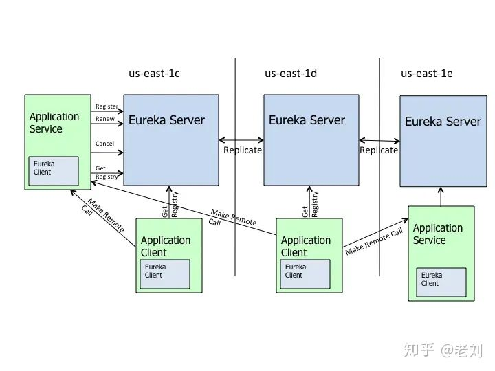
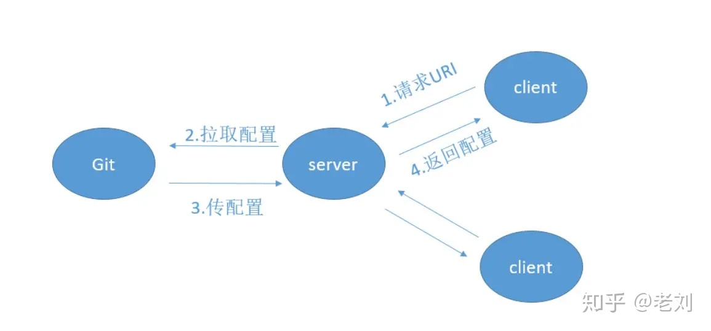

Spring Cloud 入门总结
---


什么是Spring Cloud
---
构建分布式系统不需要复杂和容易出错。Spring Cloud为最常见的分布式系统模式提供了一种简单且易于接受的编程模型，帮助开发人员构建有弹性、可靠的、协调的应用程序。Spring Cloud构建与Spring Boot之上，使得开发者很容易入手并开速应用于生产中。  

Spring Cloud就是微服务系统的一站式解决方案，在平时我们构建微服务的过程中需要做**服务发现注册、配置中心、消息总线、负载均衡、断路器、数据监控**等操作，而Spring Cloud为我们提供了一套简易的编程模型，使我们能在Spring Boot的基础上轻松地实现微服务项目的构建。  

Spring Cloud 的版本
---
Spring Cloud 的版本号并不是我们通常见的数字版本号，而是一些很奇怪的单词。这些单词均为英国伦敦地铁站的站名。同时根据字母表的顺序来对应版本时间顺序，比如：最早 的 Release 版本 Angel，第二个 Release 版本 Brixton（英国地名），然后是 Camden、 Dalston、Edgware、Finchley、Greenwich、Hoxton。

Spring Cloud的服务发现框架——Eureka
---
Eureka是基于REST（代表性状态转移）的服务，主要在AWS云中用于定位服务，以实现负载均衡和中间层服务器的故障转移。我们称此服务为Eureka服务器。Eureka还带有一个基于Java的客户端组件Eureka Client，它使与服务的加偶好变得更加容易。客户端还具有一个内置的负载平衡器，可以执行基本的循环负载平衡。在Netflix，更复杂的负载均衡器将Eureka包装起来，已基于流量，资源使用，错误条件等多种因素提供加权负载均衡，已提供出色的弹性。  

总的来说，Eureka就是一个服务发现框架。何为服务，何又为发现呢？

**服务发现**：整个过程中有三个角色：**服务提供者、服务消费者、服务中介**。

**服务提供者**：就是提供一些自己能够执行的一些服务给外界。

**服务消费者**：就是需要使用一些服务的“用户”

**服务中介**：其实就是服务提供者和服务消费者之间的“桥梁”，服务提供者可以把自己注册到服务中介那里，而服务消费者如需要消费一些服务（使用一些功能）就可以再服务中介诶中寻找注册在服务中介的服务提供者。

**服务注册Register**：当Eureka客户端香Eureka Server注册时，它提供自身的元数据，比如IP地址、端口、运行状况指示符URL，主页等。

**服务续约Renew**：Eureka**客户会每隔30秒（默认情况下）发送一次心跳来续约**。通过续约来告知Eureka Server该Eureka客户仍然存在，没有出现问题。正常情况下，如果Eureka Server在90秒没有收到Eureka客户的续约，它会将示例从其注册表中删除。

**获取注册列表Fetch Registries**：Eureka客户端从服务器获取注册表信息，并将其缓存在本地。客户端会使用该信息查找其他服务，从而进行远程调用。该注册列表信息定期（每30秒钟）更新一次。每次返回注册列表信息可能与Eureka客户端的缓存信息不同，Eureka客户端自动处理。如果由于某种原因导致注册列表信息不能及时匹配，Eureka客户端则会更新获取真个注册表信息。Eureka如无其缓存注册列表信息，整个注册表以及每个应用程序的信息进行了压缩，压缩内容和没有压缩的内容完全相同。Eureka客户端和Eureka服务器可以使用JSON/XML格式进行通讯。在默认的情况下Eureka客户端使用压缩JSON格式来获取注册列表的信息。

**服务下线Cancel**：Eureka客户端在程序关闭时向Eureka服务器发送取消请求。发送请求后，该客户端实例信息将从服务器的实例注册表中删除。该下限请求驳回自动完成，它需要调用一下内容：
```java
DiscoveryManager.getInstance().shutdownComponent();
```

**服务剔除Eviction**：在默认的情况下，当**Eureka客户端连续90秒（3个续约周期）没有向Eureka服务器发送服务续约，即心跳，Eureka服务器会将该服务实例从服务注册列表删除，即服务剔除。

下面就是Netflix官方给出的Eureka架构图。



可以充当服务发现的组件有很多：Zookeeper，Consul，Eureka等。

负载均衡值Ribbon
---

什么是RestTemplate？
---

**RestTemplate是Spring提供的一个访问Http服务的客户端类**，微服务之间的调用是使用RestTemplate。

```java
//消费者B需要调用提供者A所提供的服务
@Autowired
private RestTemplate restTemplate;
//这里是提供者A的ip地址，但是如果使用了Eureka 呢么就应该是提供者A的名称
private static final String SERVICE_PROVICER_A = "http://localhost:8081";

@PostMapping("/judge")
public boolean judge(@RequestBody Request request) {
	String url = SERVICE_PROVICER_A + "/service1";
	return restTemplate.postForObject(usl, request, Boolean.class);
}
```

如果你对源码感兴趣的话，你会发现上面我们所讲的Eureka框架中的注册、续约等，底层都是使用的RestTemplate。

为什么需要Ribbon？
---
Ribbon 是 Netflix 公司的一个开源的负载均衡 项目，是一个客户端/进程内负载均衡器，**运行在消费者端**。

Nginx和Ribbon的对比
---

提到负载均衡就不得不提到大名鼎鼎的Nignx了，而和Ribbon不同的是，它是一种集中式的负载均衡器。

**将所有请求都几种起来，然后再进行负载均衡。**  如下图。


`Nginx` 是接收了所有的请求进行负载均衡的，而对于 `Ribbon` 来说它是在消费者端进行的负载均衡。如下图。


请注意Request的位置，在Nginx中请求是先进入负载均衡器，而在Ribbon中是现在客户端进行负载均衡才进行请求的。  

Ribbon的几种负载均衡算法
---

- Nginx

   - 轮询（round robin）

     默认按照轮询（round robin）的方式进行负载均衡，每个请求按照Ip顺序分配到不同的后端服务器，会维护一个服务器列表，如果护短服务器down掉，可以将down掉的服务器剔除。  

     Nginx会进行服务器健康状态监测，如果某台服务器挂掉了，用户请求就不会再跳转到挂掉的服务器上，避免出现影响使用的情况。

     ```
     upstream sunsite{
     	server 192.168.0.12:80;
         server 192.168.0.12:81;
     }
     ```

     

     缺点：可靠性低，和负载分配不均衡（如果后端服务器性能不一致的话）

   - 加权轮询（Weighted Round Robin）

     针对每台后端服务器性能不一致的情况，可以对性能较好的服务器进行侧重分配用户请求，对性能不搞的服务器分配少一夕额用户请求：

     ```
     upstream sunsite{
     	server 192.168.0.12:80 weight=7;
         server 192.168.0.12:81 weight=3;
     }
     ```

     指定轮询几率，权重为7的A服务器访问几率会比权重为3的B服务器大

     大概是10次会访问7次A，剩下的3次才会访问B

- Ribbon

  - RoundRobinRule：轮询策略。Ribbon默认采用的策略。若经过一轮轮眉没有找到可用的provider，其最多轮询10轮。若最终还没有找到，则返回null。
  - RandomRule：随机策略，从所有可用的provider中随机选择一个。
  - RetryRule：重试策略。先按照RoundRobinRule策略获取provider。若获取失败，则在是定的时限内重试。默认的时限为500毫秒。

  ```
  //默认时间轮询算法
  providerName:
    ribbon:
      NFLoaBalancerRuleClassName: com.netflix.loadbalancer.RandomRule	
  ```
什么是Open Feign
---

  有了 `Eureka`，`RestTemplate`，`Ribbon` 我们就可以 愉快地进行服务间的调用了，但是使用 `RestTemplate` 还是不方便，我们每次都要进行这样的调用。

```java
@Autowired
private RestTemplate restTemplate;
// 这里是提供者A的ip地址，但是如果使用了 Eureka 那么就应该是提供者A的名称
private static final String SERVICE_PROVIDER_A = "http://localhost:8081";
 
@PostMapping("/judge")
public boolean judge(@RequestBody Request request) {
    String url = SERVICE_PROVIDER_A + "/service1";
    // 是不是太麻烦了？？？每次都要 url、请求、返回类型的 
    return restTemplate.postForObject(url, request, Boolean.class);
}
```

这样每次都调用 `RestRemplate` 的 `API` 是否太麻烦，我能不能像**调用原来代码一样进行各个服务间的调用呢？**

聪明的小朋友肯定想到了，那就用 **映射** 呀，就像域名和IP地址的映射。我们可以将被调用的服务代码映射到消费者端，这样我们就可以 **“无缝开发”**啦。

OpenFeign 也是运行在消费者端的，使用 Ribbon 进行负载均衡，所以 OpenFeign 直接内置了 Ribbon。

在导入了 `Open Feign` 之后我们就可以进行愉快编写 `Consumer` 端代码了。

```
// 使用 @FeignClient 注解来指定提供者的名字
@FeignClient(value = "eureka-client-provider")
public interface TestClient {
    // 这里一定要注意需要使用的是提供者那端的请求相对路径，这里就相当于映射了
    @RequestMapping(value = "/provider/xxx",
    method = RequestMethod.POST)
    CommonResponse<List<Plan>> getPlans(@RequestBody planGetRequest request);
}
```

然后我们在 `Controller` 就可以像原来调用 `Service` 层代码一样调用它了。

```
@RestController
public class TestController {
    // 这里就相当于原来自动注入的 Service
    @Autowired
    private TestClient testClient;
    // controller 调用 service 层代码
    @RequestMapping(value = "/test", method = RequestMethod.POST)
    public CommonResponse<List<Plan>> get(@RequestBody planGetRequest request) {
        return testClient.getPlans(request);
    }
}
```
必不可少的 Hystrix
---
什么是 Hystrix之熔断和降级
---

在分布式环境中，不可避免地会有许多服务依赖项中的某些失败。Hystrix是一个库，可通过添加等待时间容限和容错逻辑来帮助您控制这些分布式服务之间的交互。Hystrix通过隔离服务之间的访问点，停止服务之间的级联故障并提供后备选项来实现此目的，所有这些都可以提高系统的整体弹性。

总体来说 `Hystrix` 就是一个能进行 **熔断** 和 **降级** 的库，通过使用它能提高整个系统的弹性。

那么什么是 熔断和降级 呢？再举个 ，此时我们整个微服务系统是这样的。服务A调用了服务B，服务B再调用了服务C，但是因为某些原因，服务C顶不住了，这个时候大量请求会在服务C阻塞。


服务C阻塞了还好，毕竟只是一个系统崩溃了。但是请注意这个时候因为服务C不能返回响应，那么服务B调用服务C的的请求就会阻塞，同理服务B阻塞了，那么服务A也会阻塞崩溃。

> 请注意，为什么阻塞会崩溃。因为这些请求会消耗占用系统的线程、IO 等资源，消耗完你这个系统服务器不就崩了么。


这就叫 **服务雪崩**。

所谓 **熔断** 就是服务雪崩的一种有效解决方案。当指定时间窗内的请求失败率达到设定阈值时，系统将通过 **断路器** 直接将此请求链路断开。

也就是我们上面服务B调用服务C在指定时间窗内，调用的失败率到达了一定的值，那么 `Hystrix`则会自动将 服务B与C 之间的请求都断了，以免导致服务雪崩现象。

其实这里所讲的 **熔断** 就是指的 `Hystrix` 中的 **断路器模式** ，你可以使用简单的 `@HystrixCommand` 注解来标注某个方法，这样 `Hystrix` 就会使用 **断路器** 来“包装”这个方法，每当调用时间超过指定时间时(默认为1000ms)，断路器将会中断对这个方法的调用。

当然你可以对这个注解的很多属性进行设置，比如设置超时时间，像这样。

```java
@HystrixCommand(
    commandProperties = {@HystrixProperty(name = "execution.isolation.thread.timeoutInMilliseconds",value = "1200")}
)
public List<Xxx> getXxxx() {
    // ...省略代码逻辑
}
```

**降级是为了更好的用户体验，当一个方法调用异常时，通过执行另一种代码逻辑来给用户友好的回复**。这也就对应着 `Hystrix` 的 **后备处理** 模式。你可以通过设置 `fallbackMethod` 来给一个方法设置备用的代码逻辑。比如这个时候有一个热点新闻出现了，我们会推荐给用户查看详情，然后用户会通过id去查询新闻的详情，但是因为这条新闻太火了(比如最近什么*易对吧)，大量用户同时访问可能会导致系统崩溃，那么我们就进行 **服务降级** ，一些请求会做一些降级处理比如当前人数太多请稍后查看等等。

```java
// 指定了后备方法调用
@HystrixCommand(fallbackMethod = "getHystrixNews")
@GetMapping("/get/news")
public News getNews(@PathVariable("id") int id) {
    // 调用新闻系统的获取新闻api 代码逻辑省略
}
// 
public News getHystrixNews(@PathVariable("id") int id) {
    // 做服务降级
    // 返回当前人数太多，请稍后查看
}
```

微服务网关——Zuul
---

ZUUL 是从设备和 web 站点到 Netflix 流应用后端的所有请求的前门。作为边界服务应用，ZUUL 是为了实现动态路由、监视、弹性和安全性而构建的。它还具有根据情况将请求路由到多个 Amazon Auto Scaling Groups（亚马逊自动缩放组，亚马逊的一种云计算方式） 的能力

在上面我们学习了 `Eureka` 之后我们知道了 *服务提供者* 是 *消费者* 通过 `Eureka Server` 进行访问的，即 `Eureka Server` 是 *服务提供者* 的统一入口。那么整个应用中存在那么多 *消费者*需要用户进行调用，这个时候用户该怎样访问这些 *消费者工程* 呢？当然可以像之前那样直接访问这些工程。但这种方式没有统一的消费者工程调用入口，不便于访问与管理，而 Zuul 就是这样的一个对于 *消费者* 的统一入口。

> 如果学过前端的肯定都知道 Router 吧，比如 Flutter 中的路由，Vue，React中的路由，用了 Zuul 你会发现在路由功能方面和前端配置路由基本是一个理。 我偶尔撸撸 Flutter。

大家对网关应该很熟吧，简单来讲网关是系统唯一对外的入口，介于客户端与服务器端之间，用于对请求进行**鉴权**、**限流**、 **路由**、**监控**等功能。


没错，网关有的功能，`Zuul` 基本都有。而 `Zuul` 中最关键的就是 **路由和过滤器** 了，在官方文档中 `Zuul` 的标题就是

> Router and Filter : Zuul

Zuul 的路由功能
---

比如这个时候我们已经向 `Eureka Server` 注册了两个 `Consumer` 、三个 `Provicer` ，这个时候我们再加个 `Zuul` 网关应该变成这样子了。


```
server:
  port: 9000
eureka:
  client:
    service-url:
      # 这里只要注册 Eureka 就行了
      defaultZone: http://localhost:9997/eureka
```

然后在启动类上加入 `@EnableZuulProxy` 注解就行了。没错，就是那么简单 。

统一前缀
---

就是我们可以在前面加一个统一的前缀，比如我们刚刚调用的是 `localhost:9000/consumer1/studentInfo/update`，这个时候我们在 `yaml` 配置文件中添加如下。

```
zuul:
  prefix: /zuul
```

这样我们就需要通过 `localhost:9000/zuul/consumer1/studentInfo/update` 来进行访问了。

路由策略配置
---

你会发现前面的访问方式(直接使用服务名)，需要将微服务名称暴露给用户，会存在安全性问题。所以，可以自定义路径来替代微服务名称，即自定义路由策略。

```
zuul:
  routes:
    consumer1: /FrancisQ1/**
    consumer2: /FrancisQ2/**
```

这个时候你就可以使用 `localhost:9000/zuul/FrancisQ1/studentInfo/update` 进行访问了。

服务名屏蔽
---

这个时候你别以为你好了，你可以试试，在你配置完路由策略之后使用微服务名称还是可以访问的，这个时候你需要将服务名屏蔽。

```
zuul:
  ignore-services: "*"
```

路径屏蔽
---

`Zuul` 还可以指定屏蔽掉的路径 URI，即只要用户请求中包含指定的 URI 路径，那么该请求将无法访问到指定的服务。通过该方式可以限制用户的权限。

```
zuul:
  ignore-patterns: **/auto/**
```

> ** 代表匹配多级任意路径
> *代表匹配一级任意路径

敏感请求头屏蔽
---

默认情况下，像 Cookie、Set-Cookie 等敏感请求头信息会被 zuul 屏蔽掉，我们可以将这些默认屏蔽去掉，当然，也可以添加要屏蔽的请求头。

Zuul 的过滤功能
---

如果说，路由功能是 `Zuul` 的基操的话，那么**过滤器**就是 `Zuul`的利器了。毕竟所有请求都经过网关(Zuul)，那么我们可以进行各种过滤，这样我们就能实现 **限流**，**灰度发布**，**权限控制**等等。

### 简单实现一个请求时间日志打印

要实现自己定义的 `Filter` 我们只需要继承 `ZuulFilter` 然后将这个过滤器类以 `@Component`注解加入 Spring 容器中就行了。

在给你们看代码之前我先给你们解释一下关于过滤器的一些注意点。


过滤器类型：Pre、Routing、Post。前置Pre就是在请求之前进行过滤，Routing路由过滤器就是我们上面所讲的路由策略，而Post后置过滤器就是在 `Response` 之前进行过滤的过滤器。你可以观察上图结合着理解，并且下面我会给出相应的注释。

```java
// 加入Spring容器
@Component
public class PreRequestFilter extends ZuulFilter {
    // 返回过滤器类型 这里是前置过滤器
    @Override
    public String filterType() {
        return FilterConstants.PRE_TYPE;
    }
    // 指定过滤顺序 越小越先执行，这里第一个执行
    // 当然不是只真正第一个 在Zuul内置中有其他过滤器会先执行
    // 那是写死的 比如 SERVLET_DETECTION_FILTER_ORDER = -3
    @Override
    public int filterOrder() {
        return 0;
    }
    // 什么时候该进行过滤
    // 这里我们可以进行一些判断，这样我们就可以过滤掉一些不符合规定的请求等等
    @Override
    public boolean shouldFilter() {
        return true;
    }
    // 如果过滤器允许通过则怎么进行处理
    @Override
    public Object run() throws ZuulException {
        // 这里我设置了全局的RequestContext并记录了请求开始时间
        RequestContext ctx = RequestContext.getCurrentContext();
        ctx.set("startTime", System.currentTimeMillis());
        return null;
    }
}
```

```java
// lombok的日志
@Slf4j
// 加入 Spring 容器
@Component
public class AccessLogFilter extends ZuulFilter {
    // 指定该过滤器的过滤类型
    // 此时是后置过滤器
    @Override
    public String filterType() {
        return FilterConstants.POST_TYPE;
    }
    // SEND_RESPONSE_FILTER_ORDER 是最后一个过滤器
    // 我们此过滤器在它之前执行
    @Override
    public int filterOrder() {
        return FilterConstants.SEND_RESPONSE_FILTER_ORDER - 1;
    }
    @Override
    public boolean shouldFilter() {
        return true;
    }
    // 过滤时执行的策略
    @Override
    public Object run() throws ZuulException {
        RequestContext context = RequestContext.getCurrentContext();
        HttpServletRequest request = context.getRequest();
        // 从RequestContext获取原先的开始时间 并通过它计算整个时间间隔
        Long startTime = (Long) context.get("startTime");
        // 这里我可以获取HttpServletRequest来获取URI并且打印出来
        String uri = request.getRequestURI();
        long duration = System.currentTimeMillis() - startTime;
        log.info("uri: " + uri + ", duration: " + duration / 100 + "ms");
        return null;
    }
}
```

### 令牌桶限流

当然不仅仅是令牌桶限流方式，`Zuul` 只要是限流的活它都能干，这里我只是简单举个 。

我先来解释一下什么是 **令牌桶限流** 吧。

首先我们会有个桶，如果里面没有满那么就会以一定 **固定的速率** 会往里面放令牌，一个请求过来首先要从桶中获取令牌，如果没有获取到，那么这个请求就拒绝，如果获取到那么就放行。很简单吧，啊哈哈、

下面我们就通过 `Zuul` 的前置过滤器来实现一下令牌桶限流。

```java
@Component
@Slf4j
public class RouteFilter extends ZuulFilter {
    // 定义一个令牌桶，每秒产生2个令牌，即每秒最多处理2个请求
    private static final RateLimiter RATE_LIMITER = RateLimiter.create(2);
    @Override
    public String filterType() {
        return FilterConstants.PRE_TYPE;
    }
 
    @Override
    public int filterOrder() {
        return -5;
    }
 
    @Override
    public Object run() throws ZuulException {
        log.info("放行");
        return null;
    }
 
    @Override
    public boolean shouldFilter() {
        RequestContext context = RequestContext.getCurrentContext();
        if(!RATE_LIMITER.tryAcquire()) {
            log.warn("访问量超载");
            // 指定当前请求未通过过滤
            context.setSendZuulResponse(false);
            // 向客户端返回响应码429，请求数量过多
            context.setResponseStatusCode(429);
            return false;
        }
        return true;
    }
}
```

### 关于 Zuul 的其他

`Zuul` 的过滤器的功能肯定不止上面我所实现的两种，它还可以实现 **权限校验**，包括我上面提到的 **灰度发布** 等等。

当然，`Zuul` 作为网关肯定也存在 **单点问题** ，如果我们要保证 `Zuul` 的高可用，我们就需要进行 `Zuul` 的集群配置，这个时候可以借助额外的一些负载均衡器比如 `Nginx` 。

## Spring Cloud配置管理——Config

### 为什么要使用进行配置管理？

当我们的微服务系统开始慢慢地庞大起来，那么多 `Consumer` 、`Provider` 、`Eureka Server`、`Zuul` 系统都会持有自己的配置，这个时候我们在项目运行的时候可能需要更改某些应用的配置，如果我们不进行配置的统一管理，我们只能**去每个应用下一个一个寻找配置文件然后修改配置文件再重启应用**。

首先对于分布式系统而言我们就不应该去每个应用下去分别修改配置文件，再者对于重启应用来说，服务无法访问所以直接抛弃了可用性，这是我们更不愿见到的。

那么有没有一种方法**既能对配置文件统一地进行管理，又能在项目运行时动态修改配置文件呢？**

那就是我今天所要介绍的 `Spring Cloud Config` 。

> 能进行配置管理的框架不止 `Spring Cloud Config` 一种，大家可以根据需求自己选择（disconf，阿波罗等等）。而且对于 `Config` 来说有些地方实现的不是那么尽人意。

### Config 是什么

> `Spring Cloud Config` 为分布式系统中的外部化配置提供服务器和客户端支持。使用 `Config`服务器，可以在中心位置管理所有环境中应用程序的外部属性。

简单来说，`Spring Cloud Config` 就是能将各个 应用/系统/模块 的配置文件存放到 **统一的地方然后进行管理**(Git 或者 SVN)。

你想一下，我们的应用是不是只有启动的时候才会进行配置文件的加载，那么我们的 `Spring Cloud Config` 就暴露出一个接口给启动应用来获取它所想要的配置文件，应用获取到配置文件然后再进行它的初始化工作。就如下图。



当然这里你肯定还会有一个疑问，如果我在应用运行时去更改远程配置仓库(Git)中的对应配置文件，那么依赖于这个配置文件的已启动的应用会不会进行其相应配置的更改呢？

答案是不会的。

什么？那怎么进行动态修改配置文件呢？这不是出现了 **配置漂移** 吗？你个渣男 ，你又骗我！

别急嘛，你可以使用 `Webhooks` ，这是 `github` 提供的功能，它能确保远程库的配置文件更新后客户端中的配置信息也得到更新。

噢噢，这还差不多。我去查查怎么用。

慢着，听我说完，`Webhooks` 虽然能解决，但是你了解一下会发现它根本不适合用于生产环境，所以基本不会使用它的。

而一般我们会使用 `Bus` 消息总线 + `Spring Cloud Config` 进行配置的动态刷新。

## 引出 Spring Cloud Bus

> 用于将服务和服务实例与分布式消息系统链接在一起的事件总线。在集群中传播状态更改很有用（例如配置更改事件）。

你可以简单理解为 `Spring Cloud Bus` 的作用就是**管理和广播分布式系统中的消息**，也就是消息引擎系统中的广播模式。当然作为 **消息总线** 的 `Spring Cloud Bus` 可以做很多事而不仅仅是客户端的配置刷新功能。

而拥有了 `Spring Cloud Bus` 之后，我们只需要创建一个简单的请求，并且加上 `@ResfreshScope` 注解就能进行配置的动态修改了，下面我画了张图供你理解。


## 总结

这篇文章中我带大家初步了解了 `Spring Cloud` 的各个组件，他们有

- Eureka 服务发现框架
- Ribbon 进程内负载均衡器
- Open Feign 服务调用映射
- Hystrix 服务降级熔断器
- Zuul 微服务网关
- Config 微服务统一配置中心
- Bus 消息总线

如果你能这个时候能看懂下面那张图，也就说明了你已经对 `Spring Cloud` 微服务有了一定的架构认识。

[Spring Cloud 入门总结](https://zhuanlan.zhihu.com/p/95696180?from_voters_page=true)  


