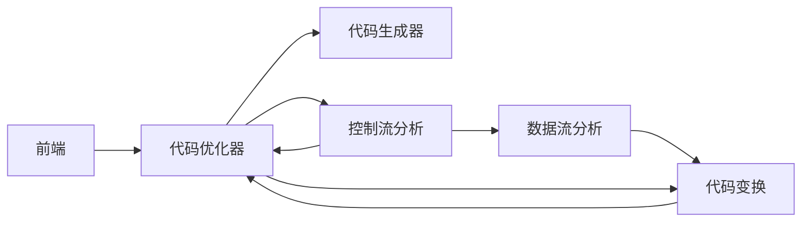

# 代码优化
[代码优化](https://baike.baidu.com/item/%E4%BB%A3%E7%A0%81%E4%BC%98%E5%8C%96/571727?fr=aladdin)
所谓代码优化是指对程序代码进行等价（指不改变程序的运行结果）变换。程序代码可以是中间代码（如四元式代码[^四元代码]），也可以是目标代码。等价的含义是使得变换后的代码运行结果与变换前代码运行结果相同。优化的含义是最终生成的目标代码短（运行时间更短，占用空间更小），时空效率优化。原则上，优化可以在编译的各个阶段进行，但最主要的一类是对中间代码进行优化，这类优化不依赖于具体的计算机。
[^四元代码]: [中间代码生成之四元式](https://blog.csdn.net/qq_44623737/article/details/107271485)
- 四元式定义
四元式是一种“三地址语句”的等价表示。一般形式：（op, arg1, arg2, result)
即<操作>，<操作数1>，<操作数2>，<结果>
其中，op为一个二元(也可是一元或零元)运算符; arg1,arg2分别为它的两个运算对象，它们可以是变量、常数或系统定义的临时变量名；运算的结果将放入result中。四元式还可写为类似于C语言的赋值语句的形式：result := arg1 op arg2
- 四元式格式
每个四元式只能有一个运算符，所以，一个复杂的表达式只能由多个四元式构成的序列表示。
例如，表达式A+B * C可写为序列
T1:=B * C
T2:=A+T1
- 例题
A + B * ( C + D ) + E / ( C - D ) ^N
（1）（  +    C   D   T1  ）
（2）（  *     B   T1  T2 ）
（3）（  +    A   T2  T3 ）
（4）（ －   C    D   T4 ）
（5）（  ^     T4   N   T5 ）
（6）（   /    E     T5   T6 ）
（7）（  +    T3    T6   T7 ）

## 代码优化过程
等价：不改变程序执行效果
变换：引进程序形式上的变动

## 途径
改进、提高程序途径：
1. 改进算法
2. 在源程序级上等价变换
3. 充分利用系统提供的程序库
4. 编译时优化等

## 优化目的
产生高效的目标代码

## 为什么要实施优化
优化程度是编译器的一个重要技术、质量目标；
无法苛求用户对源语言的掌握，编程技巧.编写源程序的优化；
编译程序固有的缺陷：不是面对一个或一类具体问题的程序，而是统一处理该语言的各种源程序，无法尽善尽美。

## 优化所涉及的源程序的范围
局部优化 — 基本块内优化；
循环优化 — 隐式、显式循环体内优化；
全局优化 — 一个源程序范围内优化；
优化相对于编译逻辑功能实现的阶段,中间代码级 — 目标代码生成前的优化；目标代码级 — 目标代码生成后的优化。

## 具优化功能编译器的组织

## 分类
编译过程中可进行的优化可按阶段划分：优化可在编译的不同阶段进行，分为中间代码一级和目标代码一级的优化。可按优化涉及的程序范围划分：对同一阶段，分为局部优化,循环优化和全局优化. 进行优化所需要的基础是对代码进行数据流分析和控制流分析。如划分DAG，查找循环，分析变量的定值点和引用点等等。最常用的代码优化技术有删除多余运算，循环不变代码外提，强度削弱，变换循环控制条件，合并已知量与复写传播，以及删除无用赋值等等。

静态网页与动态网页主要根据网页制作的语言来区分：
- 静态网页使用语言：HTML（超文本标记语言）
- 动态网页使用语言：HTML+ASP或HTML+PHP或HTML+JSP等。

网站源码可以分为动态源码和静态源码：
- 动态源码：ASP、PHP、JSP、.net、CGI等等,动态源码最大的特点就是能够和用户之间互动。
- 静态源码：html、Flash、JavaScript、VBScript等等。

## 局部优化
在编译原理中，局部优化指在程序的一个基本块内进行的优化
### 基本块
一顺序执行的最大语句序列，只有惟一入口和惟一出口，且分别对应该序列的第一个语句和最后一个语句 。
### 基本块特点
基本块内的语句是顺序执行的，没有转进转出，分叉汇合 
### 基本块划分
1. 确定每个基本块的入口语句。
根据基本块的结构特点，它的入口语句是下述三种类型的语句之一:⑴ 程序的第一个语句；⑵ 由条件转移语句或无条件转移语句转移 到的语句；⑶ 紧跟在条件转移或无条件转移后面的语句。 
2. 根据确定的基本块的入口语句，构造其所属的基本块。
	1. 由该入口语句直到下一个入口语句(不包含下一个入口语句)之间的所有语句构成一个基本块；
	2. 由该入口语句到程序中的停止或暂停语句或最后一个语句(包含该停止或暂停或最后语句)之间的语句序列组成的。
3. 凡是未包含在基本块中的语句，都是程序的控制流不可到达的语句，直接从程序中删除。

## 要点
1. 尽量采用div+css布局您的页面，div+css布局的好处是让搜索引擎爬虫能够更顺利的、更快的、更友好的爬完您的页面；div+css布局还可以大量缩减网页大小，提高浏览的速度，使得代码更简洁、流畅、更容易放置更多内容。
2. 尽量缩减您的页面大小，因为搜索引擎爬虫每次爬行您的站点时，存储数据的容量有限，一般建议100KB以下，越小越好，但不能小于5KB。网页大小减少还有一个好处，能够促使您的站点形成巨大的内部链接网。
3. 尽量少用无用的图片和flash。内容索引所派出的搜索引擎爬虫，不认识图片，只能根据图片“ALT,TITLE”等属性的内容判断图片的内容。对于flash搜索引擎爬虫更是视而不见。
4. 尽量满足w3c标准，网页代码的编写满足W3C标准，能够提升网站和搜索引擎的友好度，因为搜索引擎收录标准，排名算法，都是在W3C标准的基础上开发的。
5. 尽量更深层次套用标签h1、h2、h3、h4、h5…..，让搜索引擎能够分辨清晰网页那一块很重要，那一块次之。
6. 尽量少用JS，JS代码全部用外部调用文件封装。搜索引擎不喜欢JS，影响网站的友好度指数。
7. 尽量不使用表格布局，因为搜索引擎对表格布局嵌套3层以内的内容懒的去抓取。搜索引擎爬虫有时候也是比较懒的，望各位一定要保持代码和内容在3层以内。
8. 尽量不让CSS分散在HTML标记里，尽量封装到外部调用文件。如果CSS出现在HTML标记里，搜索引擎爬虫就要分散注意力去关注这些对优化没有任何意义的东西，所以建议封装到专用CSS文件中。
9. 清理垃圾代码，要把代码编辑环境下敲击键盘上的空格键所产生的符号；把一些默认属性代码，不会影响显示的代码；注释语句如果对代码可读性没有太大影响，清理这些垃圾代码，会减少不少的空间。

