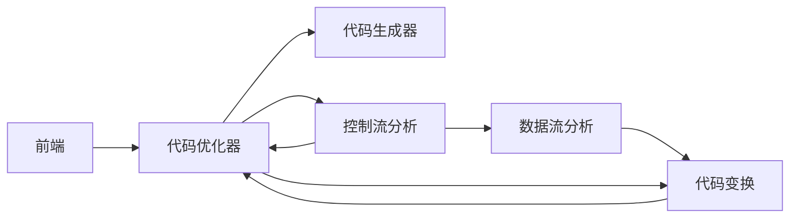

# 代码优化
[代码优化](https://baike.baidu.com/item/%E4%BB%A3%E7%A0%81%E4%BC%98%E5%8C%96/571727?fr=aladdin)
所谓代码优化是指对程序代码进行等价（指不改变程序的运行结果）变换。程序代码可以是中间代码（如四元式代码[^四元代码]），也可以是目标代码。等价的含义是使得变换后的代码运行结果与变换前代码运行结果相同。优化的含义是最终生成的目标代码短（运行时间更短，占用空间更小），时空效率优化。原则上，优化可以在编译的各个阶段进行，但最主要的一类是对中间代码进行优化，这类优化不依赖于具体的计算机。
[^四元代码]: [中间代码生成之四元式](https://blog.csdn.net/qq_44623737/article/details/107271485)
- 四元式定义
四元式是一种“三地址语句”的等价表示。一般形式：（op, arg1, arg2, result)
即<操作>，<操作数1>，<操作数2>，<结果>
其中，op为一个二元(也可是一元或零元)运算符; arg1,arg2分别为它的两个运算对象，它们可以是变量、常数或系统定义的临时变量名；运算的结果将放入result中。四元式还可写为类似于C语言的赋值语句的形式：result := arg1 op arg2
- 四元式格式
每个四元式只能有一个运算符，所以，一个复杂的表达式只能由多个四元式构成的序列表示。
例如，表达式A+B * C可写为序列
T1:=B * C
T2:=A+T1
- 例题
A + B * ( C + D ) + E / ( C - D ) ^N
（1）（  +    C   D   T1  ）
（2）（  *     B   T1  T2 ）
（3）（  +    A   T2  T3 ）
（4）（ －   C    D   T4 ）
（5）（  ^     T4   N   T5 ）
（6）（   /    E     T5   T6 ）
（7）（  +    T3    T6   T7 ）

## 代码优化过程
等价：不改变程序执行效果
变换：引进程序形式上的变动

## 途径
改进、提高程序途径：
1. 改进算法
2. 在源程序级上等价变换
3. 充分利用系统提供的程序库
4. 编译时优化等

## 优化目的
产生高效的目标代码

## 为什么要实施优化
优化程度是编译器的一个重要技术、质量目标；
无法苛求用户对源语言的掌握，编程技巧.编写源程序的优化；
编译程序固有的缺陷：不是面对一个或一类具体问题的程序，而是统一处理该语言的各种源程序，无法尽善尽美。

## 优化所涉及的源程序的范围
局部优化 — 基本块内优化；
循环优化 — 隐式、显式循环体内优化；
全局优化 — 一个源程序范围内优化；
优化相对于编译逻辑功能实现的阶段,中间代码级 — 目标代码生成前的优化；目标代码级 — 目标代码生成后的优化。

## 具优化功能编译器的组织


## 分类
编译过程中可进行的优化可按阶段划分：优化可在编译的不同阶段进行，分为中间代码一级和目标代码一级的优化。可按优化涉及的程序范围划分：对同一阶段，分为局部优化,循环优化和全局优化. 进行优化所需要的基础是对代码进行数据流分析和控制流分析。如划分DAG，查找循环，分析变量的定值点和引用点等等。最常用的代码优化技术有删除多余运算，循环不变代码外提，强度削弱，变换循环控制条件，合并已知量与复写传播，以及删除无用赋值等等。

静态网页与动态网页主要根据网页制作的语言来区分：
- 静态网页使用语言：HTML（超文本标记语言）
- 动态网页使用语言：HTML+ASP或HTML+PHP或HTML+JSP等。

网站源码可以分为动态源码和静态源码：
- 动态源码：ASP、PHP、JSP、.net、CGI等等,动态源码最大的特点就是能够和用户之间互动。
- 静态源码：html、Flash、JavaScript、VBScript等等。

## 局部优化
在编译原理中，局部优化指在程序的一个基本块内进行的优化
### 基本块
一顺序执行的最大语句序列，只有惟一入口和惟一出口，且分别对应该序列的第一个语句和最后一个语句 。
### 基本块特点
基本块内的语句是顺序执行的，没有转进转出，分叉汇合 
### 基本块划分
1. 确定每个基本块的入口语句。
根据基本块的结构特点，它的入口语句是下述三种类型的语句之一:⑴ 程序的第一个语句；⑵ 由条件转移语句或无条件转移语句转移 到的语句；⑶ 紧跟在条件转移或无条件转移后面的语句。 
2. 根据确定的基本块的入口语句，构造其所属的基本块。
	1. 由该入口语句直到下一个入口语句(不包含下一个入口语句)之间的所有语句构成一个基本块；
	2. 由该入口语句到程序中的停止或暂停语句或最后一个语句(包含该停止或暂停或最后语句)之间的语句序列组成的。
3. 凡是未包含在基本块中的语句，都是程序的控制流不可到达的语句，直接从程序中删除。

## 要点
1. 尽量采用div+css布局您的页面，div+css布局的好处是让搜索引擎爬虫能够更顺利的、更快的、更友好的爬完您的页面；div+css布局还可以大量缩减网页大小，提高浏览的速度，使得代码更简洁、流畅、更容易放置更多内容。
2. 尽量缩减您的页面大小，因为搜索引擎爬虫每次爬行您的站点时，存储数据的容量有限，一般建议100KB以下，越小越好，但不能小于5KB。网页大小减少还有一个好处，能够促使您的站点形成巨大的内部链接网。
3. 尽量少用无用的图片和flash。内容索引所派出的搜索引擎爬虫，不认识图片，只能根据图片“ALT,TITLE”等属性的内容判断图片的内容。对于flash搜索引擎爬虫更是视而不见。
4. 尽量满足w3c标准，网页代码的编写满足W3C标准，能够提升网站和搜索引擎的友好度，因为搜索引擎收录标准，排名算法，都是在W3C标准的基础上开发的。
5. 尽量更深层次套用标签h1、h2、h3、h4、h5…..，让搜索引擎能够分辨清晰网页那一块很重要，那一块次之。
6. 尽量少用JS，JS代码全部用外部调用文件封装。搜索引擎不喜欢JS，影响网站的友好度指数。
7. 尽量不使用表格布局，因为搜索引擎对表格布局嵌套3层以内的内容懒的去抓取。搜索引擎爬虫有时候也是比较懒的，望各位一定要保持代码和内容在3层以内。
8. 尽量不让CSS分散在HTML标记里，尽量封装到外部调用文件。如果CSS出现在HTML标记里，搜索引擎爬虫就要分散注意力去关注这些对优化没有任何意义的东西，所以建议封装到专用CSS文件中。
9. 清理垃圾代码，要把代码编辑环境下敲击键盘上的空格键所产生的符号；把一些默认属性代码，不会影响显示的代码；注释语句如果对代码可读性没有太大影响，清理这些垃圾代码，会减少不少的空间。

## html优化
html代码是最为基础的网站制作语言，对于网站优化来说，html代码也有一定的影响，是特别需要注意的优化细节之一。
### title标签
html代码是最为基础的网站制作语言，对于网站优化来说，html代码也有一定的影响，是特别需要注意的优化细节之一。
### META元素
title标签就是网页的标题，是一个对于网站优化有很大影响的html标签，每个页面都必须有且内容不同！
基本格式为
```html
<title>网页标题。</title>
```
### h标签
h标签在html代码中是“标题”的意思，就如一篇文章，标题是文章最为重要的一个对象，也是搜索引擎在排名时重点考虑的一个对象。html中的h标签一共有六个，分别是h1/h2/h3/h4/h5/h6，分别代表不同的级别，我们称之为一级标题、二级标题……当然，一级标题具备更多的权重。需要注意的是h标签是块级元素，默认是粗体显示，独占一行，前后会有空行。当然，你可以利用css来改变这些效果。
关于h标签的使用，需要根据实际情况来使用，不可任意滥用。如一篇文章，不可能出现多个一级标题，所以h1，在同一个页面中只能出现一次，而h2等则可以出现多次，根据你需要表现的内容的重要程度，分别使用不同的h标签即可。特别注意，h标签中最好出现关键字！还有就是，随其自然，万不可刻意地用h标签来处理某些关键字！
基本格式
```html
<h1>这里是标题文字</h1>
```
### 加强喝强调
strong被认为是“加强”，em被认为是“强调”，也就是这两个标签是有特殊含义的，这对于网站优化至关重要。多数时候，我们在优化网站时会对关键字进行突出，这时使用strong或em就比使用B或者I好很多，特别谨记！
### alt和title
alt是图像中的注释，title是图像或链接的标题，这两者对于优化，尤其是图像的优化至关重要，但也不要滥用！一般在插入图像时，我们在alt中设置图像的描述内容，其中可以包含关键字但不要故意堆砌，title则当作图像标题来处理。特别需要注意的是，这些内容是不可以重复的！也就是说，当你的页面中有多张图像，你不能每张图像的描述和标题都设置成一样的，这样很容易被搜索引擎惩罚！
```html

```
除此之外，title属性在a标签中也有所使用，只是有些泛滥了，视觉效果也不好，影响用户体验，所以笔者并不推荐，除非你的a标签中的内容是一张图片。
```html
<a href="product.html"title="产品展示">产品展示</a>
```
### 缩写abbr
这个标签是自定义的一种缩写方式，可以利用它合理的添加一些关键字，同样不要滥用。如下所示：
　　公司的产品涉及
```html
<abbr title="以石材为原料的雕刻作品">石雕</abbr>
<abbr title="以铜料为胚，运用雕刻、铸塑等手法制作的一种造型艺术">铜雕</abbr>
<abbr title="附属在某一平面上的雕刻艺术">浮雕</abbr>
```
镂雕等各种雕刻形式。
### canonical标签
Canonical(权威链接标记)是09年，Google，Yahoo及Microsoft三大搜索引擎联合推出了一个旨在减少重复内容的一个建议，并不是命令，也就是说这个标签搜索引擎可能不遵守。国内最大的中文搜索引擎百度也已经支持Canonical标签。
部分搜索引擎引入了Link的一个新属性Canonical。A页面声明B为权威链接，B声明C为权威网页，则搜索引擎会认为C是A和B共同的首选权威版本。此时Canonical标签起到了301重定向的作用。
只能作用于同一个域名所在的网址，不能作用于不同域名上的重复内容。也就是说如果文章被其它网站抄袭，也不会因为这个标签而给你的原文章带来权重。如果是跨站，可以使用301重定向。该链接标签可用于定义相对地址，也可用于定义绝对地址。但为了保险起见，建议使用绝对地址。
使用方法：为网页指定权威链接（authoritative|canonical URL），以解决副本内容（duplicate content）问题。
使用样式：
```html
<link rel=”canonical” href=”网页权威链接”/>
```

## css优化
于网站排名优化来说，css的几乎没有任何影响，但往大的方向如网站优化来说，样式表css的优化就至关重要了，其主要作用即是提高网页的响应速度。
### 外链css
css的使用有多种方式，一是嵌入式，即在html标签中直接定义样式表，如下所示:
```css
<p style="font-family:arial;font-size:16px;font-weight:bold;">Outside now its raining,and tears are falling from my eyes…</p>
```
还有一种是直接定义在页面头部的如下：
```css
<styletype="text/css">p{ background:#f1f1f1; color:#333; line-height:20px;} </style>
```
这两种方式都是把css写在当前html中，这样会造成hml文档变大，降低网页的响应速度，所以我们需要外链css，将所有与本页面相关的样式写入到该样式表中：
```css
<link href="style/common.css"rel="stylesheet"type="text/css"/>
```
### 精简css
对于这一点需要一定的css能力才可以做到了。所谓精简，指的是用尽可能少的样式代码实现整个网页的样式效果，需要充分利用css的继承和综合使用，举一个简单的例子来说明。如页面中的链接，全部不需要下划线、大部分为12像素，但链接的颜色并不相同，个别的字体效果也不相同，我们就可以这样来写：
```css
a{ text-decoration:none; font-size:12px;}/*定义通用a样式*/
　　a.a_red{ color:#e00;}
　　a.a_blue{ color:#009;}
　　a.a_menu{ color:#fff; font-size:14px; font-weight:bold;}/*针对特殊a标签只指定特殊样式*/
```
因为css的继承作用，a_red和a_blue都具备没有下划线、12像素这一样式，而a_menu同样具备没有下划线，但因指定了大小，就不再继承12像素的指定而使用14像素……
### 整合css
一般情况下，前端制作人员喜欢把通用样式写成一个文件，把专用样式写成另一个文件以便各个页面调用。如笔者，就喜欢把页面通用样式（包括通用的布局样式、文字样式等）写在common.css中，而把专用的写在另一个样式表中。如首页，我们就需要调用common.css和index.css两个样式表文件。这样做，对于前端来说是正确的。但对于优化，却不太好。多一个文件调用就需要多一次请求，当然也会多耗费一点时间。所以，在网站制作完成后，我们需要把页面的所有样式合并大一起以提高网页的响应速度！但需注意，合并css不利于网站后期整改，权衡利弊各取所需吧，具体是否合并还需根据你的实际情况而定。
### 压缩css
压缩css其实很简单，就是去掉多余的空格和换行。实现起来也非常的简单，网上有很多工具，请自行搜索“css压缩”即可找到很多在线压缩工具。同上面一点，压缩后的css不便于后期整改，需要自己权衡取舍。

## script优化
javascript代码对于网站排名优化同样没有多大影响，但从网站优化的角度来看却是至关重要的一步优化操作，优良的javascript代码可以大幅度提升网页的响应速度！
### 外链js代码
js代码跟css的使用差不多，都有三种方式：
```js
//内部定义：
<A onclick="if(confirm('确认？'){...}else{...})"href="#">confirm</A>
//头部插入：
<script>...</script>
//外链调用：
<SCRIPT language=javascript type=text/javascript src="jquery-1.7.2.min.js"></SCRIPT>
```
### 精简js代码
这一点需要更为专业的js技术才能做到，尽可能根据需要实现的效果编写js，而不用从网上找一段代码直接拿来用，网上的代码很多功能很全，从而质量很大，而其中的很多功能对于我们要实现的效果是没有任何用处的，所以广拓企业网站建议你针对需要实现的效果定制js以便得到更为精简的代码，从而提高网页的响应速度。
### 压缩js代码
对于这点，网上也有很多的工具，请百度查询“js压缩工具”即可。
### 置底js
一般情况下，我们都是把js放到head之间的，这种方式在页面加载时即会加载，当然也就导致响应速度的降低，百度站长平台建议把js放到页面最底部，也就是</html>之外。等html加载完毕之后才加载js代码，当然，有部分特殊功能的js代码是没有办法放到页面底部的，具体请根据实际情况操作。
补充说明：针对js图像特效等，可能会影响网站关键字排名的！有的特效图像的路径、说明等都是写入到js中的，这种特效尽量不要使用。

## 优化禁忌
### 究竟要优化什么？
在优化工作开始的时候，你还尚未明确优化内容和目的，那么你很容易陷入误区。在一开始，你就应该清楚地了解你要达到的效果，以及其他优化相关的各种问题。这些目标需要明确指出（至少精通技术的项目经理可以理解和表达它），接下来，在整个优化过程中，你需要坚持这些目标。
在实际的项目开发中，经常会存在各种各样的变数。可能一开始时要优化这一方面，随后你可能会发现需要优化另一方面。这种情况下，你需要清晰地了解这些变化，并确保团队中的每个人都明白目标已经发生了变化。
### 选择一个正确的优化指标
选择正确的指标，是优化的一个重要组成部分，你需要按照这些指标来测量优化工作的进展情况。如果指标选择不恰当，或者完全错误，你所做的努力有可能白费了。
　　即使指标正确，也必须有一些辨别。在某些情况下，将最多的努力投入到运行消耗时间最多的那部分代码中，这是实用的策略。但也要记住，Unix/Linux内核的大部分时间花费在了空循环上。
　　需要注意的是，如果你轻易选择了一个很容易达到的指标，这作用不大，因为没有真正解决问题。你有必要选择一个更复杂的、更接近你的目标的指标。
### 优化在刀刃上
这是有效优化的关键。找到项目中与你的目标（性能、资源或其他）相背的地方，并将你的努力和时间用在那里。
　　举一个典型的例子，一个Web项目速度比较慢，开发者在优化时将大部分精力放在了数据库优化上，最终发现真正的问题是网络连接慢。
　　另外，不要分心于容易实现的问题。这些问题尽管很容易解决，但可能不是必要的，或与你的目标不相符。容易优化并不意味着值得你花费工夫。
### 优化层次越高越好
在一般情况下，优化的层次越高，就会越有效。根据这个标准，最好的优化是找到一个更有效的算法。举个例子，在一个软件开发项目中，有一个重要的应用程序性能较差，于是开发团队开始着手优化，但性能并没有提升太多，之后，项目人员交替，新的开发人员在检查代码时发现，性能问题的核心是由于在表中使用了冒泡排序算法，导致成千上万项的增加。
　　尽管如此，高层次的优化也不是“银弹”。一些基本技术，如将所有东西移到循环语句外，也可以产生一些优化的效果。通常情况下，大量低层次的优化可以产生等同于一个高层次优化的效果。
　　还需要注意的是，高层次优化，会减少一些代码块，那么你之前对这些代码块所做的优化就没有任何意义了，因此，刚开始就应该考虑高层次的优化。
### 不要过早优化
在项目早期就进行优化，会导致你的代码难以阅读，或者会影响运行。另一方面，在项目后期，你可能会发现之前所做的优化没有起到任何作用，白白浪费了时间和精力。正确的方式是，你应该将项目开发和优化当作两个独立的步骤来做。
### 依赖性能分析，而不是直觉
你往往会认为你已经知道哪里需要优化，这是不可取的，尤其是在复杂的软件系统中，性能分析数据应该是第一位的，最后才是直觉。

　　优化的一个有效的策略是，你要根据所做工作对优化效果的影响来进行排序。在开始工作之前找到影响最大的“路障”，然后再处理小的“路障”。

### 优化不是万金油
优化最重要的规则之一是，你无法优化一切，甚至无法同时优化两个问题。比如，优化了速度，可能会增加资源利用；优化了存储的利用率，可能会使其他地方放慢。你需要权衡一下，哪个更符合你的优化目标。


